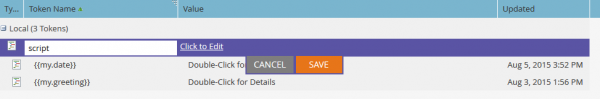

# 电子邮件脚本

有关Velocity模板语言行为的详细说明，请阅读[Velocity用户指南](https://velocity.apache.org/engine/devel/user-guide.html)。

[Apache Velocity](https://velocity.apache.org/)是一种基于Java的语言，用于模板化和编写HTML内容的脚本。 在Marketo电子邮件脚本令牌中使用Velocity可访问存储在商机和自定义对象中的数据并创建动态电子邮件内容。

Velocity为条件内容和迭代内容提供了`if`/`else`、`for`和`foreach`控制流。

## 变量

为变量添加前缀`$`。 使用`#set`创建或更新它们：

```velocity
#set($variable = "value")
```

使用提供不同行为的引用类型检索变量值：

```text
$variable ##outputs 'value'
$variablename ##outputs '$variablename'
${variable}name ##outputs 'valuename'
```


`$`之后的静默引用表示法包括`!`。 默认情况下，当引用未定义时，Velocity将保留引用字符串。 静默引用未定义时不会发送任何值：

```velocity
##Defined Reference

#set($foo = "bar")
$foo ##outputs "bar"

##Undefined Reference

##normal
$baz ##outputs "$baz"

##quiet
$!baz ##outputs nothing
```

有关如何引用变量的更多信息，请参阅[Apache用户指南](https://velocity.apache.org/engine/devel/user-guide.html#formal-reference-notation)。

## Velocity工具

Apache Velocity项目提供[Velocity工具](https://velocity.apache.org/tools/devel/apidocs/overview-summary.html)。 这些包装器通过可用于所有脚本的全局变量公开Java对象方法。

- [AlternatorTool](https://velocity.apache.org/tools/devel/apidocs/org/apache/velocity/tools/generic/AlternatorTool.html)
- [Comparisondatetool](https://velocity.apache.org/tools/devel/apidocs/org/apache/velocity/tools/generic/ComparisonDateTool.html)
- [ConversionTool](https://velocity.apache.org/tools/devel/apidocs/org/apache/velocity/tools/generic/ConversionTool.html)
- [DateTool](https://velocity.apache.org/tools/devel/apidocs/org/apache/velocity/tools/generic/DateTool.html)
- [显示工具](https://velocity.apache.org/tools/devel/apidocs/org/apache/velocity/tools/generic/DisplayTool.html)
- [MathTool](https://velocity.apache.org/tools/devel/apidocs/org/apache/velocity/tools/generic/MathTool.html)
- [数字工具](https://velocity.apache.org/tools/devel/apidocs/org/apache/velocity/tools/generic/NumberTool.html)
- [EscapeTool](https://velocity.apache.org/tools/devel/apidocs/org/apache/velocity/tools/generic/EscapeTool.html)
- [LoopTool](https://velocity.apache.org/tools/devel/apidocs/org/apache/velocity/tools/generic/LoopTool.html)

例如，要使用`ComparisonDateTool`中的方法，请从脚本令牌中的`$date`变量访问该方法：

```velocity
#set($birthday = $convert.parseDate("2015-08-07","yyyy-MM-dd"))
##use whenIs to determine how many days away it is
$date.whenIs($birthday).days ##outputs 1
```

## 创建脚本令牌

向带有电子邮件脚本令牌的电子邮件添加Velocity脚本。 在营销文件夹或项目的营销活动中创建令牌。

要使用令牌，电子邮件必须是拥有该令牌的程序的子项，或从营销文件夹继承该令牌。 转到文件夹或项目群，然后选择[!UICONTROL My Tokens]选项卡。 将右侧菜单中的“电子邮件脚本”选项拖入令牌列表。


编辑令牌名称，然后选择[!UICONTROL Click to Edit]以打开编辑器：



在编辑器中，创建一个脚本，用于访问可访问脚本的对象中的变量。 要添加对象字段引用，请将其从右树拖动到脚本中：


## 脚本嵌入和测试

在程序“我的令牌”中定义脚本后，从Marketo电子邮件编辑器中的电子邮件引用该脚本。


在Marketo Email Designer中使用[!UICONTROL Send Sample Email]操作测试脚本。 在[!UICONTROL Lead]字段中选择现有潜在客户，以便脚本正确处理。

测试`$TriggerObject`时，选择包含[!UICONTROL Trigger]参数的触发对象。 Marketo使用该类型的最近更新的对象作为`$TriggerObject`变量。


您还可以使用[!UICONTROL Email Preview]进行测试。 选择&#x200B;**[!UICONTROL View As: Lead Detail]**，然后从静态列表中选择潜在客户。 预览还会显示脚本执行的异常：


## 最佳实践

给定电子邮件中所有电子邮件脚本令牌的组合长度不得超过100,000字节。 此限制与令牌字符串本身的总长度有关（而不是令牌扩展后的总长度）。

- 电子邮件脚本中引用的变量必须存在于Marketo中且位于脚本可用的某个对象上。
- 您可以引用来自本机集成CRM的第一级和第二级自定义对象，这些自定义对象直接连接到Lead或Contact，但不包括第三级自定义对象。 自定义对象不能是潜在客户或公司的父级
- 对于Marketo自定义对象，您可以引用具有父子关系的二级自定义对象。 例如：`Lead <- Parent <- Child`。 您无法引用具有Edge-Bridge关系的第二级自定义对象。 例如，`Lead <- Bridge -> Edge`
- 您可以引用连接到Lead、Contact或Account的自定义对象，但不能引用多个对象。
- 只能通过单个连接、潜在客户、联系人或帐户引用自定义对象
- 选中脚本编辑器中的框，以查看您正在使用的字段，或者这些字段不处理
- 对于每个自定义对象，每个人员/联系人在运行时都可以使用最近更新的10条记录。 记录按照从索引0处最近更新的到索引9处最旧的顺序排列。 您可以按照说明](https://experienceleague.adobe.com/en/docs/marketo/using/product-docs/administration/email-setup/change-custom-object-retrieval-limits-in-velocity-scripting)将可用记录数增加[。
- 如果电子邮件中包含多个电子邮件脚本，则它们将自上而下执行。 在第一个要执行的脚本中定义的变量的范围在后续脚本中可用。
- 工具引用： [https://velocity.apache.org/tools/2.0/index.html](https://velocity.apache.org/tools/2.0/index.html)
- 有关包含换行字符“\n”或“\r\n”的令牌的注释。 通过发送示例或批量促销活动发送电子邮件时，令牌中的换行字符会被替换为空格。 通过触发器营销活动发送电子邮件时，新行字符保持不变。
- 要确保正确的URL解析，请将完整路径设置为变量，然后打印该变量。 请勿在URL引用内打印变量。 将协议（`http://`或`https://`）与URL的其余部分分开包含。 输出完整的锚点(`<a>`)标记，以便可以跟踪链接。 未跟踪来自`for`或`foreach`循环的链接输出。

```html
<!-- Correct -->
#set($url = "www.example.com/${object.id}")
<a href="http://${url}">Link Text</a>

<!-- Correct -->
<a href="http://www.example.com/${object.id}">Link Text</a>

<!-- Incorrect -->
<a href="${url}">Link Text</a>

<!-- Incorrect -->
<a href="{{my.link}}">Link Text</a>

<!-- Incorrect -->
<a href="http://{{my.link}}">Link Text</a>
```
