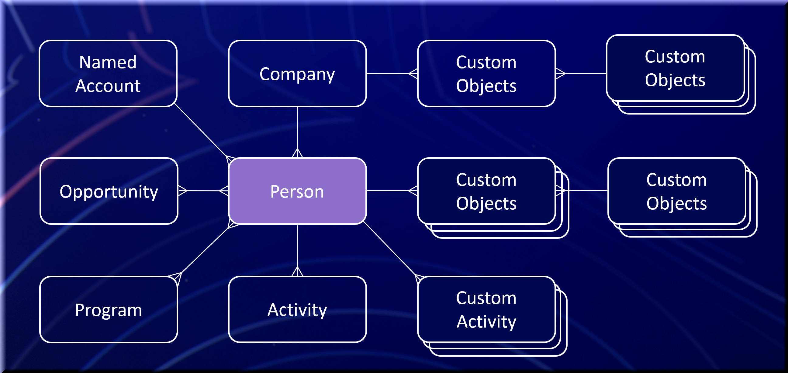

# 快速入门

Marketo Engage是一个营销自动化平台，用于为潜在客户和客户管理个性化的多渠道项目和营销活动。 您可以通过平台的集成点扩展该平台。

本页介绍核心Marketo Engage实体及其关系。

>[!NOTE]
>
>SOAP API已被弃用，在2026年7月31日后将不再可用。 将Marketo [REST API](./rest-api/rest-api.md)用于所有新开发。 在此日期之前迁移现有服务以避免服务中断。 如果服务使用SOAP API，请参阅SOAP API [迁移指南](./soap-api/migration.md)。
>

在Marketo Engage实例上启用本机SFDC或MS Dynamics CRM连接后，这些对象为只读：

- 公司
- 机会
- 机会角色
- 销售人员

## 人员（潜在客户）

人才是营销自动化的基础。 Marketo将所有非销售人员记录称为潜在客户，无论销售人员认为他们是潜在客户、潜在客户、可疑人员还是联系人。

潜在客户对象包括标准字段，例如电子邮件、名字和姓氏。 您可以添加字段以存储其他信息，也可以使用与标准字段相同的方式读取和写入自定义属性。 在Marketo中的&#x200B;**[!UICONTROL Admin]** > **[!UICONTROL Field Management]**&#x200B;下查找完整的字段列表。

Marketo通过id字段唯一标识潜在客户。 必须在系统外强制实施其他唯一键。

相关API： [REST](https://developer.adobe.com/marketo-apis/api/mapi#tag/Leads)，[JavaScript](javascript-api/lead-tracking.md#lead-tracking-api)

## 活动

潜在客户可以通过多种方式与您的组织交互，例如访问网页、参加贸易展览或下载白皮书。 Marketo将这些操作捕获为活动，以便营销人员能够了解潜在客户的行为及其发生时间。

活动始终与按leadId排列的潜在客户相关。

您还可以定义自定义活动。 创建和发布自定义活动后，可以通过Marketo API添加其实例。 有关详细信息，请参阅[了解自定义活动](https://experienceleague.adobe.com/zh-hans/docs/marketo/using/product-docs/administration/marketo-custom-activities/understanding-custom-activities)。

相关API： [REST](https://developer.adobe.com/marketo-apis/api/mapi#tag/Activities)，[JavaScript](javascript-api/lead-tracking.md#munchkin-behavior)

## 项目和营销策划

项目在一个位置组织营销人员相关的营销工作。 例如，电子邮件爆炸可以是程序。

潜在客户可以执行与项目群关联的多个操作或活动。 此过程称为潜在客户进展。 对于电子邮件爆炸程序，进度可以记录Marketo发送电子邮件的时间、用户打开电子邮件的时间以及用户是否单击链接。

营销活动在项目中用于特定目的和目标。 例如，营销活动可以选择一组潜在客户并发送电子邮件直播。 当商机单击电子邮件爆炸中的链接时，另一个Campaign可以通知销售代表。

相关API： [REST](https://developer.adobe.com/marketo-apis/api/mapi#tag/Campaigns)

## 标记

标记对项目数据进行分组和分类以便进行报告。 使用标记衡量计划效果和ROI。

作为Marketo管理员，您可以创建用户创建项目时选择的必需和可选标记类型。 您可以根据公司的报告要求定义每种标记类型的可能值。

例如，使用值（如Northeast和Southeast）创建自定义“区域”标记类型，以分析哪个区域产生的商机最多。 创建“所有者”标记类型，比较哪些项目所有者（如Maria、David或John）对创建潜在客户和机会的影响最大。 有关详细信息，请参阅[了解标记](https://experienceleague.adobe.com/zh-hans/docs/marketo/using/product-docs/core-marketo-concepts/programs/working-with-programs/understanding-tags)。

相关API： [REST](https://developer.adobe.com/marketo-apis/api/asset)

## 列表

列出组织潜在客户集合。 Marketo提供两种类型：

- 静态列表是营销人员可以从中添加或删除潜在客户的固定集合。
- 智能列表是基于已定义特性的动态集合。

例如，名为“所有访问过我们网站上的定价页面的潜在客户”的智能列表会随着更多潜在客户访问该页面而继续增长。 有关详细信息，请参阅[Marketo Engage文档](https://experienceleague.adobe.com/zh-hans/docs/marketo/using/home)。

相关API： [REST](https://developer.adobe.com/marketo-apis/api/asset#tag/Static-Lists)

## 商机

机会表示营销人员交付给销售人员的潜在销售交易。 在Marketo中， opportunity与lead或contact以及组织相关联。

商机角色将销售线索与组织关联起来，并描述该销售线索在该组织中的功能。

相关API： [REST](https://developer.adobe.com/marketo-apis/api/mapi#tag/Opportunities)

## 公司

组织（有时在Marketo中称为帐户）是人员所属的组织。

要在Marketo ROI报告或Revenue Cycle Analytics (RCA)中准确归因ROI，请将人员与其组织和机会关联起来。

相关API： [REST](https://developer.adobe.com/marketo-apis/api/mapi#tag/Companies)

## 资产

Assets包括项目中使用的登陆页面、电子邮件、表单和图像。 资产可以是特定项目的本地资产，也可以是全局资产。 全球资源可用于每个项目。

相关API： [REST](https://developer.adobe.com/marketo-apis/api/asset)

## 令牌

令牌允许营销人员使用资产个性化消息，并向流程操作添加逻辑。 Marketo为整个系统、项目、潜在客户和公司提供令牌。

例如，将潜在客户令牌`{{lead.First Name}}`放入电子邮件中，以显示潜在客户的名字。

在Marketo中，在项目或文件夹级别定义的令牌称为“我的令牌”。 我的令牌分为三种类型：

- 本地：在特定营销活动文件夹或项目群中创建，仅在该文件夹或项目群中可用。
- 继承：在营销活动文件夹级别创建，可用于该文件夹中的所有项目。
- 已覆盖：使用项目群级别的自定义值修改了该值，而没有在项目群文件夹级别更改父“我的令牌”值。

我的令牌使用命名约定`{{my.My Token}}`，令牌名称的开头包含“my”一词。 例如，名为EventDate的日期类型“我的令牌”的令牌名称为`{{my.EventDate}}`。 有关详细信息，请参阅[了解程序中的我的令牌](https://experienceleague.adobe.com/zh-hans/docs/marketo/using/product-docs/core-marketo-concepts/programs/tokens/understanding-my-tokens-in-a-program)。

相关API： [REST](https://developer.adobe.com/marketo-apis/api/asset#tag/Tokens)

## 自定义对象

Marketo自定义对象可在Marketo潜在客户与自定义对象记录之间创建一对多或多对多关系(Edge-Bridge-Edge)。

创建并发布Marketo自定义对象后，可以通过Marketo API对其执行CRUD操作。 添加新记录时，您可以使用智能列表触发器做出响应。 您也可以将自定义对象数据用作智能列表过滤器，以通过[电子邮件脚本](email-scripting.md)进行分段，或在电子邮件中使用。 有关创建自定义对象的更多信息，请参阅[Marketo Engage文档](https://experienceleague.adobe.com/zh-hans/docs/marketo/using/home)。

相关API： [REST](https://developer.adobe.com/marketo-apis/api/mapi#tag/Custom-Objects)

## 销售人员

在未启用本机CRM集成时，您可以在Marketo中管理销售人员记录及其潜在客户关系。 这些记录包含名称、电子邮件和职务等信息。 当销售人员拥有商机时，您可以使用此信息进行筛选和标记。

通过“externalSalesPersonId”字段在潜在客户级别管理与销售人员的关系。 通过[同步潜在客户](https://developer.adobe.com/marketo-apis/api/mapi#tag/Leads/operation/syncLeadUsingPOST) API更新此字段。

相关API： [REST](https://developer.adobe.com/marketo-apis/api/mapi#tag/Sales-Persons)
