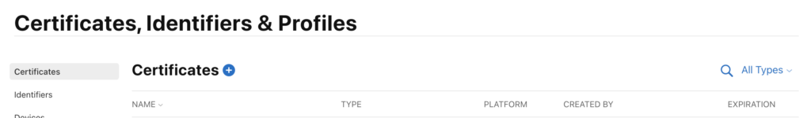
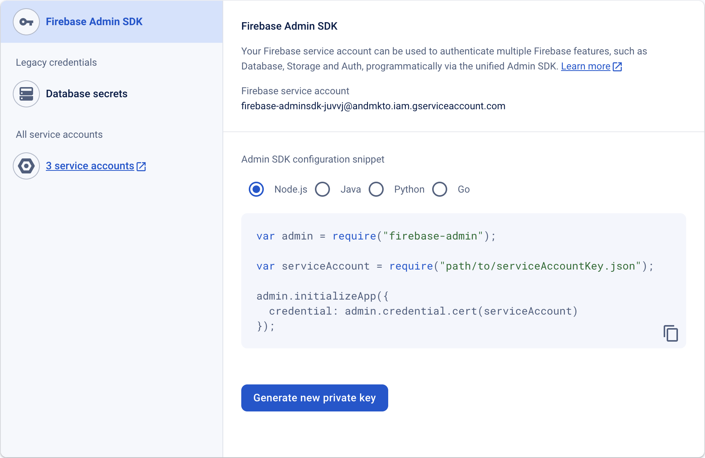

# 推送通知

为使用Marketo Mobile SDK的iOS或Android应用程序启用推送通知。

## 在iOS中设置推送通知

启用推送通知有三个步骤：

1. 在Apple开发人员帐户中配置推送通知。
1. 在xCode中启用推送通知。
1. 使用Marketo SDK在应用程序中启用推送通知。

### 在Apple开发人员帐户上配置推送通知

1. 登录到Apple开发人员[成员中心](https://developer.apple.com/membercenter)。
1. 选择“Certificates， Identifiers &amp; Profiles”。
1. 选择“iOS， tvOS， watchOS”下的“Certificates->All”文件夹。
1. 选择左上角证书旁边的“+”。
1. 选择“Apple推送通知服务SSL（沙盒和生产）”，然后选择继续。
1. 选择用于生成应用程序的应用程序标识符。
1. 创建并上传CSR以生成推送证书。
1. 下载证书并双击以安装。
1. 打开“密钥链访问”，右键单击证书，然后将这两个项目导出到`.p12`文件。
1. 通过Marketo Admin Console上传此文件以配置通知。
1. 更新应用程序设置配置文件。

### 在xCode中启用推送通知

在xCode项目中打开推送通知功能。

### 使用Marketo SDK在应用程序中启用推送通知

将以下代码添加到`AppDelegate.m`文件以将推送通知交付给客户设备。

**注意** — 如果您使用[!DNL Adobe Launch]扩展名，请使用`ALMarketo`作为类名。

将以下导入添加到`AppDelegate.h`。

>[!BEGINTABS]

>[!TAB 目标C]

```objectivec
#import <UserNotifications/UserNotifications.h>
```

>[!TAB Swift]

```swift
import UserNotifications
```

>[!ENDTABS]

将`UNUserNotificationCenterDelegate`添加到`AppDelegate`，如下所示。

>[!BEGINTABS]

>[!TAB 目标C]

```objectivec
@interface AppDelegate : UIResponder <UIApplicationDelegate, UNUserNotificationCenterDelegate>
```

>[!TAB Swift]

```swift
class AppDelegate: UIResponder, UIApplicationDelegate , UNUserNotificationCenterDelegate
```

>[!ENDTABS]

添加以下代码以初始化推送通知服务。

>[!BEGINTABS]

>[!TAB 目标C]

```objectivec
BOOL)application:(UIApplication *)application didFinishLaunchingWithOptions:(NSDictionary *)launchOptions {
UNUserNotificationCenter *center = [UNUserNotificationCenter currentNotificationCenter];
        center.delegate = self;
        [center requestAuthorizationWithOptions:(UNAuthorizationOptionSound | UNAuthorizationOptionAlert | UNAuthorizationOptionBadge) completionHandler:^(BOOL granted, NSError * _Nullable error){
            if(!error){
                dispatch_async(dispatch_get_main_queue(), ^{
                    [[UIApplication sharedApplication] registerForRemoteNotifications];
                });
            }
        }];

    return YES;
}
```

>[!TAB Swift]

```swift
func application(_ application: UIApplication, didFinishLaunchingWithOptions launchOptions: [UIApplication.LaunchOptionsKey: Any]?) -> Bool {

    UNUserNotificationCenter.current().requestAuthorization(options: [.alert, .sound,    .badge]) { granted, error in
            if let error = error {
                print("\(error.localizedDescription)")
            } else {
                DispatchQueue.main.async {
                    application.registerForRemoteNotifications()
                }
            }
        }

        return true
}
```

>[!ENDTABS]

调用此方法即可开始注册Apple推送服务。 如果注册成功，应用程序将调用应用程序委托对象的`application:didRegisterForRemoteNotificationsWithDeviceToken:`方法，并向其传递设备令牌。

如果注册失败，应用程序将改为调用其应用程序委托的`application:didFailToRegisterForRemoteNotificationsWithError:`方法。

在Marketo中注册推送令牌。 必须注册设备令牌才能从Marketo接收推送通知。

>[!BEGINTABS]

>[!TAB 目标C]

```objectivec
- (void)application:(UIApplication *)application didRegisterForRemoteNotificationsWithDeviceToken:(NSData *)deviceToken {
    // Register the push token with Marketo
    [[Marketo sharedInstance] registerPushDeviceToken:deviceToken];
}
```

>[!TAB Swift]

```swift
func application(_ application: UIApplication, didRegisterForRemoteNotificationsWithDeviceToken deviceToken: Data) {
    // Register the push token with Marketo
    Marketo.sharedInstance().registerPushDeviceToken(deviceToken)
}
```

>[!ENDTABS]

您还可以在用户注销时注销令牌。

>[!BEGINTABS]

>[!TAB 目标C]

```objectivec
[[Marketo sharedInstance] unregisterPushDeviceToken];
```

>[!TAB Swift]

```swift
Marketo.sharedInstance().unregisterPushDeviceToken
```

>[!ENDTABS]

要重新注册推送令牌，请将步骤3中的代码提取到AppDelegate方法中。 从ViewController登录方法调用该方法。

在Marketo中注册设备令牌后处理推送通知。

>[!BEGINTABS]

>[!TAB 目标C]

```objectivec
- (void)application:(UIApplication *)application didReceiveRemoteNotification:(NSDictionary *)userInfo
{
    [[Marketo sharedInstance] handlePushNotification:userInfo];
}
```

>[!TAB Swift]

```swift
func application(_ application: UIApplication, didReceiveRemoteNotification userInfo: [AnyHashable : Any]) {
    Marketo.sharedInstance().handlePushNotification(userInfo)
}
```

>[!ENDTABS]

将以下方法添加到AppDelegate。

在应用程序处于前台时，使用此方法显示警报、播放声音或增加徽章。 在此方法中调用相应的completionHandler。

>[!BEGINTABS]

>[!TAB 目标C]

```objectivec
-(void)userNotificationCenter:(UNUserNotificationCenter *)center
    willPresentNotification:(UNNotification *)notification
        withCompletionHandler:(void (^)(UNNotificationPresentationOptions options))completionHandler{

    completionHandler(UNAuthorizationOptionSound | UNAuthorizationOptionAlert | UNAuthorizationOptionBadge);
}
```

>[!TAB Swift]

```swift
func userNotificationCenter(_ center: UNUserNotificationCenter,
            willPresent notification: UNNotification, withCompletionHandler completionHandler: @escaping (
    UNNotificationPresentationOptions) -> Void) {
    completionHandler([.alert, .sound,.badge])
}
```

>[!ENDTABS]

在AppDelegate中处理新收到的推送通知。

当用户通过打开应用程序、取消通知或选择UNNotificationAction来响应通知时，委托将调用此方法。 在应用程序从applicationDidFinishLaunching：返回之前设置委托。

>[!BEGINTABS]

>[!TAB 目标C]

```objectivec
- (void)userNotificationCenter:(UNUserNotificationCenter *)center
didReceiveNotificationResponse:(UNNotificationResponse *)response withCompletionHandler:(void(^)(void))completionHandler {
    [[Marketo sharedInstance] userNotificationCenter:center didReceiveNotificationResponse:response withCompletionHandler:completionHandler];
}
```

>[!TAB Swift]

```swift
func userNotificationCenter(_ center: UNUserNotificationCenter,
                                didReceive response: UNNotificationResponse,
                                withCompletionHandler
                                completionHandler: @escaping () -> Void) {
        Marketo.sharedInstance().userNotificationCenter(center, didReceive: response, withCompletionHandler: completionHandler)
}
```

>[!ENDTABS]

跟踪推送通知。

如果应用程序处于后台或非活动状态，则设备会收到推送通知，如下所示。 Marketo会在用户选择通知时进行跟踪。


当设备收到推送通知时，会将通知传递到应用程序委托的`application:didReceiveRemoteNotification:`回调。

以下Marketo活动日志显示了应用程序事件和推送通知事件。


## 在Android中设置推送通知

1. 在应用程序标记中添加以下权限。

   打开`AndroidManifest.xml`并添加以下权限。 您的应用程序必须请求“INTERNET”和“ACCESS_NETWORK_STATE”权限。 如果应用程序已经请求这些请求，请跳过此步骤。

   ```xml
   <uses‐permission android:name="android.permission.INTERNET"/>
   <uses‐permission android:name="android.permission.ACCESS_NETWORK_STATE"/>
   
   <!‐‐Following permissions are required for push notification.‐‐>
   <uses-permission android:name="android.permission.GET_ACCOUNTS"/>
   <!‐‐Keeps the processor from sleeping when a message is received.‐‐>
   <uses-permission android:name="android.permission.WAKE_LOCK"/>
   <permission android:name="<PACKAGE_NAME>.permission.C2D_MESSAGE" android:protectionLevel="signature" />
   <uses-permission android:name="<PACKAGE_NAME>.permission.C2D_MESSAGE" />
   <!-- This app has permission to register and receive data message. -->
   <uses-permission android:name="com.google.android.c2dm.permission.RECEIVE" />
   ```

1. 使用HTTPv1设置FCM。

   - 在Marketo功能管理器中启用MME FCM HTTPv1。
   - 在MLM中上传应用程序的服务帐户Json文件。
   - 从Firebase控制台下载服务帐户Json文件。
   - 在Marketo中上传服务帐户Json文件后等待一小时，然后再发送推送通知。

## Android测试设备

将Marketo活动添加到应用程序标记内的清单文件中。

```xml
<activity android:name="com.marketo.MarketoActivity"  android:configChanges="orientation|screenSize">
    <intent-filter android:label="MarketoActivity">
        <action  android:name="android.intent.action.VIEW"/>
        <category  android:name="android.intent.category.DEFAULT"/>
        <category  android:name="android.intent.category.BROWSABLE"/>
        <data android:host="add_test_device" android:scheme="mkto"/>
    </intent-filter/>
</activity/>
```

## 注册Marketo推送服务

1. 将Firebase消息服务添加到`AndroidManifest.xml`中，然后再添加结束的应用程序标记。

   ```xml
   <meta-data
       android:name="com.google.android.gms.version"
       android:value="@integer/google_play_services_version" />
   <service android:name=".MyFirebaseMessagingService">
   <intent-filter>
   <action android:name="com.google.firebase.INSTANCE_ID_EVENT"/>
   <action android:name="com.google.firebase.MESSAGING_EVENT"/>
   </intent-filter>
   </service>
   ```

1. 按如下方式将Marketo SDK方法添加到`MyFirebaseMessagingService`。

   ```java
   import com.marketo.Marketo;
   
   public class MyFirebaseMessagingService extends FirebaseMessagingService {
   
       @Override
       public void onNewToken(String s) {
           super.onNewToken(s);
           Marketo marketoSdk = Marketo.getInstance(this.getApplicationContext());
           marketoSdk.setPushNotificaitonToken(s);
           // Add your code here...
       }
   
       @Override
       public void onMessageReceived(RemoteMessage remoteMessage) {
           Marketo marketoSdk = Marketo.getInstance(this.getApplicationContext());
           marketoSdk.showPushNotificaiton(remoteMessage);
           // Add your code here...
       }
   
   }
   ```

   **注意** — 如果您使用Adobe扩展，请添加以下代码。

   ```java
   import com.marketo.Marketo;
   
   public class MyFirebaseMessagingService extends FirebaseMessagingService {
   
       @Override
       public void onNewToken(String token) {
           super.onNewToken(token);
           ALMarketo.setPushNotificationToken(token);
           // Add your code here...
       }
   
       @Override
       public void onMessageReceived(RemoteMessage remoteMessage) {
           ALMarketo.showPushNotification(remoteMessage);
           // Add your code here...
       }
   
   }
   ```

**注意**： FCM SDK会自动添加所需的权限和接收者功能。 如果您使用的是以前的SDK版本，请删除以下过时的元素，这些元素可能会导致消息重复。

```xml
<receiver android:name="com.marketo.MarketoBroadcastReceiver" android:permission="com.google.android.c2dm.permission.SEND">
    <intent-filter>
        <!‐‐Receives the actual messages.‐‐>
        <action android:name="com.google.android.c2dm.intent.RECEIVE"/>
        <!‐‐Register to enable push notification‐‐>
        <action android:name="com.google.android.c2dm.intent.REGISTRATION"/>
        <!‐‐‐Replace YOUR_PACKAGE_NAME with your own package name‐‐>
        <category android:name="YOUR_PACKAGE_NAME"/>
    </intent-filter>
</receiver>

<!‐‐Marketo service to handle push registration and notification‐‐>
<service android:name="com.marketo.MarketoIntentService"/>
```

1. 初始化Marketo推送。 保存配置后，创建或打开Application类并添加以下代码。 从Firebase控制台获取发件人ID。

   ```java
   Marketo marketoSdk = Marketo.getInstance(getApplicationContext());
   
   // Enable push notification here. The push notification channel name can by any string
   marketoSdk.initializeMarketoPush(SENDER_ID,"ChannelName");
   ```

   如果您使用[!DNL Adobe Launch]扩展，请使用以下代码。

   ```java
   // Enable push notification here. The push notification channel name can by any string
   ALMarketo.initializeMarketoPush(SENDER_ID,"ChannelName");
   ```

   如果您没有SENDER_ID，请完成[本教程](https://developers.google.com/cloud-messaging/)中详述的步骤以启用Google Cloud Messaging Service。

   您还可以在用户注销时注销令牌。

   ```java
   marketoSdk.uninitializeMarketoPush();
   ```

   如果您使用[!DNL Adobe Launch]扩展，请使用以下代码。

   ```java
   ALMarketo.uninitializeMarketoPush();
   ```

   注意：要重新注册推送令牌，请将步骤3中的代码提取到AppDelegate方法中。 从ViewController登录方法调用该方法。

1. 可选：设置通知图标。 调用以下方法配置自定义通知图标。

   ```java
   MarketoConfig.Notification config = new MarketoConfig.Notification();
   // Optional bitmap for honeycomb and above
   config.setNotificationLargeIcon(bitmap);
   
   // Required icon Resource ID
   config.setNotificationSmallIcon(R.drawable.notification_small_icon);
   
   // Set the configuration
   //Use the static methods on ALMarketo class when using Adobe Extension
   Marketo.getInstance(context).setNotificationConfig(config);
   
   // Get the configuration set
   Marketo.getInstance(context).getNotificationConfig();
   ```

## 故障排除

如果移动推送消息无法按预期工作，请在调查实施详细信息之前检查常见配置问题。

### 推送消息未显示

检查设备上是否禁用了推送消息。 移动设备用户可以控制他们是否接收每个应用程序的消息，而开发人员或营销人员可能会在开发期间禁用消息。

检查应用程序是否处于打开和活动状态。 当应用程序处于活动状态时，移动设备推送消息不会出现在屏幕上。 而是显示在应用程序的“本地通知”区域中。

### 在Marketo中查看活动日志

使用Marketo活动日志验证是否已发送消息。

查看应接收消息人员的活动记录。 如果消息已发送，则活动日志包含记录。 如果不存在记录，请检查Marketo中的iOS证书或Android API密钥配置。

### 证书或密钥无效

验证是否为沙盒或生产加载了正确的证书。 如有必要，请重新导出iOS证书或Android密钥，并将它们重新加载到Marketo中。

### .p12文件缺少证书或密钥(iOS)

导出证书时，同时导出密钥和证书。

### 配置配置文件已过期(iOS)

添加设备后，更新设置配置文件并生成新证书。 将Xcode项目指向正确的用户档案和证书，并将证书导入Marketo。

### 无法上传iOS证书(IOS)

确保用于导出证书的密码不包含空格。 例如，不要这样：

`Hello World 123`

使用此：

`HelloWorld123`

### iOS证书疑难解答

对于沙盒应用程序，请使用“开发人员”或“通用”证书。 对于生产应用程序，请上传有效的“分发”或“通用”证书。

### 推送退回/令牌无效

在以下情况下，注册令牌可能会失效：

- 如果客户端应用程序取消向GCM注册，则为。
- 如果客户端应用程序自动取消注册，如果用户卸载该应用程序，则会发生这种情况。 例如，在iOS上，如果APNS反馈服务报告APNS令牌无效。
- 如果注册令牌过期。 例如，Google可能会决定刷新注册令牌，或iOS设备的APNS令牌已过期。
- 如果客户端应用程序已更新，但新版本未配置为接收消息。
