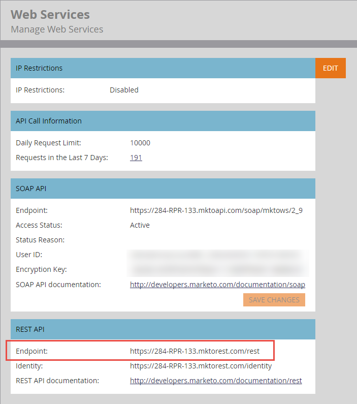

# 基本URL

此 [终结点引用](endpoint-reference.md) 每个API调用的文档显示了必须附加到基本URL以形成请求的REST方法、路径、资源和参数。

以下是格式正确的REST URL示例：

`https://284-RPR-133.mktorest.com/rest/v1/lead/318581.json?fields=email,firstName,lastName`

，包括以下几个部分：

- 基本URL： `https://284-RPR-133.mktorest.com/rest`
- 路径： `/v1/lead/`
- 资源： `318582.json`
- 查询参数： `fields=email,firstName,lastName`

基本URL包含帐户ID（也称为Munchkin ID），因此对于每个Marketo订阅都是唯一的。 通过登录Marketo并导航到 **[!UICONTROL Admin]** > **[!UICONTROL Integration]** > **[!UICONTROL Web Services]** 菜单。 它在“REST API”部分下标记为“端点：”，如以下屏幕截图所示。

找到基本URL后，请复制该URL，并将其包含在调用任何REST API时使用的URL中。
