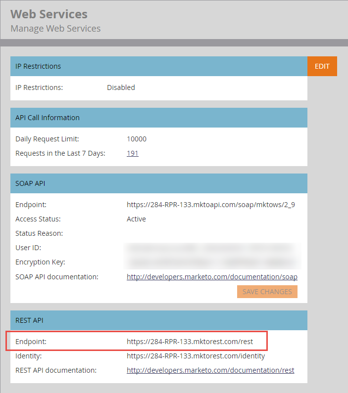

# 基本 URL

[终结点引用](endpoint-reference.md)中的每个API调用都指定了REST方法、路径、资源和参数。 将这些组件附加到基本URL以形成请求。

以下是格式正确的REST URL示例：

`https://284-RPR-133.mktorest.com/rest/v1/lead/318581.json?fields=email,firstName,lastName`

此示例包含以下组件：

- **基本URL：** `https://284-RPR-133.mktorest.com/rest`
- **路径：** `/v1/lead/`
- **资源：** `318582.json`
- **查询参数：** `fields=email,firstName,lastName`

基本URL包含帐户ID（也称为Munchkin ID），并且对于每个Marketo订阅都是唯一的。

要查找基本URL，请登录到Marketo并转到&#x200B;**[!UICONTROL Admin]** > **[!UICONTROL Integration]** > **[!UICONTROL Web Services]**。 基本URL在“REST API”部分中被标记为“端点：”，如下图所示。

复制基本URL并将其包含在每个REST API调用的URL中。
