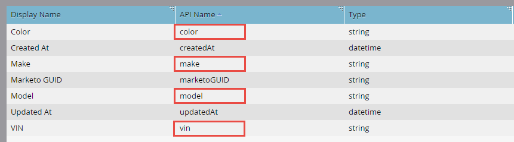

# 批量自定义对象导入

[批量自定义对象导入终结点引用](https://developer.adobe.com/marketo-apis/api/mapi/#tag/Bulk-Import-Custom-Objects)

当您有许多自定义对象记录时  导入，最佳做法是使用批量API异步导入它们。 此操作可通过导入包含分隔记录（逗号、制表符或分号）的平面文件来完成。 文件可以包含任意数量的记录，但大小必须小于10MB（否则为HTTP）  413状态代码已返回)。 文件的内容取决于您的自定义对象定义。 第一行始终包含标题，其中列出了要将每行的值映射到的字段。 标头中的所有字段名称必须匹配一个API名称（如下所述）。 其余行包含要导入的数据，每行一个记录。 记录操作仅限“插入或更新”。

## 处理限制

您可以在限制内提交多个批量导入请求。 每个请求都将作为作业添加到要处理的FIFO队列。 最多可同时处理两个作业。 在任意给定时间（包括当前正在处理的2个），队列中最多允许10个作业。 如果超过十个作业的最大值，则会返回“1016，导入次数过多”错误。

## 自定义对象示例

在使用批量API之前，必须首先使用Marketo管理UI [创建自定义对象](https://experienceleague.adobe.com/zh-hans/docs/marketo/using/product-docs/administration/marketo-custom-objects/create-marketo-custom-objects)。 例如，假设我们创建了一个具有“Color”、“Make”、“Model”和“VIN”字段的“Car”自定义对象。 以下是显示自定义对象的管理员UI屏幕。 您可以看到我们使用了VIN字段删除重复项。 API名称会突出显示，因为调用与批量API相关的端点时必须使用这些名称。


以下是管理UI中显示的自定义对象字段。



### API名称

通过将自定义对象API名称传递到[描述自定义对象](#describe)端点，您可以以编程方式检索API名称。

```
/rest/v1/customobjects/{apiName}/describe.json
```

```json
{
    "requestId": "46ff#15a686e66de",
    "result": [
        {
            "name": "car_c",
            "displayName": "Car",
            "description": "It's a car.",
            "createdAt": "2017-02-22T19:55:51Z",
            "updatedAt": "2017-02-22T19:55:51Z",
            "idField": "marketoGUID",
            "dedupeFields": [
                "vin"
            ],
            "searchableFields": [
                [
                    "vin"
                ],
                [
                    "marketoGUID"
                ]
            ],
            "fields": [
                {
                    "name": "createdAt",
                    "displayName": "Created At",
                    "dataType": "datetime",
                    "updateable": false
                },
                {
                    "name": "marketoGUID",
                    "displayName": "Marketo GUID",
                    "dataType": "string",
                    "length": 36,
                    "updateable": false
                },
                {
                    "name": "updatedAt",
                    "displayName": "Updated At",
                    "dataType": "datetime",
                    "updateable": false
                },
                {
                    "name": "color",
                    "displayName": "Color",
                    "dataType": "string",
                    "length": 255,
                    "updateable": true
                },
                {
                    "name": "make",
                    "displayName": "Make",
                    "dataType": "string",
                    "length": 255,
                    "updateable": true
                },
                {
                    "name": "model",
                    "displayName": "Model",
                    "dataType": "string",
                    "length": 255,
                    "updateable": true
                },
                {
                    "name": "vin",
                    "displayName": "VIN",
                    "dataType": "string",
                    "length": 255,
                    "updateable": true
                }
            ]
        }
    ],
    "success": true
}
```

### 导入文件

现在，假设您要导入三条“Car”自定义对象记录。 使用逗号分隔格式(CSV)，文件可能如下所示：

```
color,make,model,vin
red,bmw,2002,WBA4R7C55HK895912
yellow,bmw,320i,WBA4R7C30HK896061
blue,bmw,325i,WBS3U9C52HP970604
```

第1行是标题，第2-4行是自定义对象数据记录。

## 创建作业

要进行批量导入请求，必须在[导入自定义对象](https://developer.adobe.com/marketo-apis/api/mapi/#tag/Identity/operation/identityUsingPOST)端点的路径中包含自定义对象的API名称。 您还必须包括引用导入文件名称的“file”参数，以及指定导入文件分隔方式的“format”参数（“csv”、“tsv”或“ssv”）。

```
POST /bulk/v1/customobjects/{apiName}/import.json?format=csv
```

```
Transfer-Encoding: chunked
Content-Type: multipart/form-data; boundary=----WebKitFormBoundaryXjWP6BP8Ciq6bPeo
Content-Length: 290
Host: <munchkinId>.mktorest.com
```

```
------WebKitFormBoundaryXjWP6BP8Ciq6bPeo
Content-Disposition: form-data; name="file"; filename="custom_object_import.csv"
Content-Type: text/csv

color,make,model,vin
red,bmw,2002,WBA4R7C55HK895912
yellow,bmw,320i,WBA4R7C30HK896061
blue,bmw,325i,WBS3U9C52HP970604
------WebKitFormBoundaryXjWP6BP8Ciq6bPeo--
```

```json
{
    "requestId": "c015#15a68a23418",
    "result": [
        {
            "batchId": 1013,
            "status": "Queued",
            "objectApiName": "car_c"
        }
    ],
    "success": true
}
```

在此示例中，我们指定了“csv”格式并将导入文件命名为“custom_object_import.csv”。

请注意，在响应我们的调用时，此处没有成功或失败列表，就像从同步自定义对象端点返回一样。 您而是会收到`batchId`。 这是因为调用是异步调用，可能会返回`status`的“已排队”、“正在导入”或“失败”。 您应该保留batchId，以便获取导入作业的状态，或者在完成时检索失败和/或警告。 batchId的有效期为7天。

复制批量导入请求的简单方法是使用命令行中的curl：

```
curl -X POST -i -F format='csv' -F file='@custom_object_import.csv' -F access_token='<Access Token>' <REST API Endpoint URL>/bulk/v1/customobjects/car_c/import.json
```

其中，导入文件“custom_object_import.csv”包含以下内容：

```
color,make,model,vin
red,bmw,2002,WBA4R7C55HK895912
yellow,bmw,320i,WBA4R7C30HK896061
blue,bmw,325i,WBS3U9C52HP970604
```

## 轮询作业状态

创建导入作业后，必须查询其状态。 最佳实践是每5-30秒轮询一次导入作业。 为此，请在指向[获取导入自定义对象状态](https://developer.adobe.com/marketo-apis/api/mapi/#tag/Bulk-Import-Custom-Objects/operation/getImportCustomObjectStatusUsingGET)端点的路径中传递自定义对象的API名称和`batchId`。

```
GET /bulk/v1/customobjects/{apiName}/import/{batchId}/status.json
```

```json
{
    "requestId": "2a5#15a68dd9be1",
    "result": [
        {
            "batchId": 1013,
            "operation": "import",
            "status": "Complete",
            "objectApiName": "car_c",
            "numOfObjectsProcessed": 3,
            "numOfRowsFailed": 0,
            "numOfRowsWithWarning": 0,
            "importTime": "2 second(s)",
            "message": "Import succeeded, 3 records imported (3 members)"
        }
    ],
    "success": true
}
```

此响应显示已完成的导入，但`status`可以是：“完成”、“已排队”、“正在导入”、“失败”之一。 如果作业已完成，则会列出已处理的行数、失败行数和警告行数。 消息属性也是查找其他作业信息的好地方。

## 故障

[获取导入自定义对象状态](https://developer.adobe.com/marketo-apis/api/mapi/#tag/Bulk-Import-Custom-Objects/operation/getImportCustomObjectStatusUsingGET)响应中的`numOfRowsFailed`属性指示失败。 如果numOfRowsFailed大于零，则该值表示发生的失败次数。 调用[获取导入自定义对象失败](https://developer.adobe.com/marketo-apis/api/mapi/#tag/Bulk-Import-Custom-Objects/operation/getImportCustomObjectFailuresUsingGET)终结点，以获取包含失败详细信息的文件。 同样，您必须在路径中传递自定义对象API名称和`batchId`。 如果不存在失败文件，则会返回HTTP 404状态代码。

继续示例，我们可以通过修改标题并将“vin”更改为“vin”（通过在逗号和“vin”之间添加空格）来强制失败。

```
color,make,model, vin
```

当我们重新导入并检查状态时，我们会看到包含`numRowsFailed`的此响应： 3。 这表示出现三次故障。

```
GET /bulk/v1/customobjects/car_c/import/{batchId}/status.json
```

```json
{
    "requestId": "12260#15a68f491ed",
    "result": [
        {
            "batchId": 1016,
            "operation": "import",
            "status": "Complete",
            "objectApiName": "car_c",
            "numOfObjectsProcessed": 0,
            "numOfRowsFailed": 3,
            "numOfRowsWithWarning": 0,
            "importTime": "1 second(s)",
            "message": "Import completed with errors, 0 records imported (0 members), 3 failed"
        }
    ],
    "success": true
}
```

现在，我们进行“获取导入自定义对象失败”端点调用以获取更多失败详细信息：

```
GET /bulk/v1/customobjects/car_c/import/{batchId}/failures.json
```

```
color,make,model, vin,Import Failure Reason
red,bmw,2002,WBA4R7C55HK895912,missing.dedupe.fields
yellow,bmw,320i,WBA4R7C30HK896061,missing.dedupe.fields
blue,bmw,325i,WBS3U9C52HP970604,missing.dedupe.fields
```

我们可以看到缺少重复数据删除字段`vin`。

## 警告

获取导入自定义对象状态响应中的`numOfRowsWithWarning`属性指示警告。 如果numOfRowsWithWarning大于零，则该值表示发生的警告数。 调用[获取导入自定义对象警告](https://developer.adobe.com/marketo-apis/api/mapi/#tag/Bulk-Import-Custom-Objects/operation/getImportCustomObjectWarningsUsingGET)终结点以获取带有警告详细信息的文件。 同样，您必须在路径中传递自定义对象API名称和`batchId`。 如果不存在警告文件，则会返回HTTP 404状态代码。

```
GET /bulk/v1/customobjects/car_c/import/{batchId}/warnings.json
```
