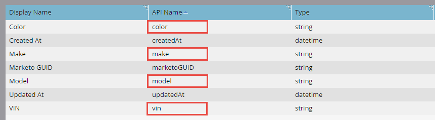

# 批量自定义对象导入

[批量自定义对象导入终结点引用](https://developer.adobe.com/marketo-apis/api/mapi#tag/Bulk-Import-Custom-Objects)

使用批量API异步导入大量自定义对象记录。 以逗号、制表符或分号分隔的平面文件提供小于10 MB的记录。 如果文件较大，则API返回HTTP 413状态代码。

文件内容取决于自定义对象定义。 第一行必须为标头，并且每个标头字段都必须匹配一个API名称。 其余每一行都包含一个记录。

批量自定义对象导入仅支持“插入或更新”记录操作。

## 处理限制

每个批量导入请求都将作为作业添加到先进先出(FIFO)队列。 以下限制适用：

- 最多可同时处理两个作业。
- 队列中最多可以有10个作业，包括正在处理的两个作业。

如果超过10个作业的最大值，则API返回`1016, Too many imports`错误。

## 自定义对象示例

在使用批量API之前，请使用Marketo管理UI [创建自定义对象](https://experienceleague.adobe.com/en/docs/marketo/using/product-docs/administration/marketo-custom-objects/create-marketo-custom-objects)。

此示例使用具有`Color`、`Make`、`Model`和`VIN`字段的`Car`自定义对象。 VIN字段用于去重。 管理员UI屏幕突出显示批量API端点所需的API名称。


以下是管理UI中显示的自定义对象字段。



### API名称

若要以编程方式检索API名称，请将自定义对象API名称传递给[描述自定义对象](#describe)端点。

```text
/rest/v1/customobjects/{apiName}/describe.json
```

```json
{
    "requestId": "46ff#15a686e66de",
    "result": [
        {
            "name": "car_c",
            "displayName": "Car",
            "description": "It is a car.",
            "createdAt": "2017-02-22T19:55:51Z",
            "updatedAt": "2017-02-22T19:55:51Z",
            "idField": "marketoGUID",
            "dedupeFields": [
                "vin"
            ],
            "searchableFields": [
                [
                    "vin"
                ],
                [
                    "marketoGUID"
                ]
            ],
            "fields": [
                {
                    "name": "createdAt",
                    "displayName": "Created At",
                    "dataType": "datetime",
                    "updateable": false
                },
                {
                    "name": "marketoGUID",
                    "displayName": "Marketo GUID",
                    "dataType": "string",
                    "length": 36,
                    "updateable": false
                },
                {
                    "name": "updatedAt",
                    "displayName": "Updated At",
                    "dataType": "datetime",
                    "updateable": false
                },
                {
                    "name": "color",
                    "displayName": "Color",
                    "dataType": "string",
                    "length": 255,
                    "updateable": true
                },
                {
                    "name": "make",
                    "displayName": "Make",
                    "dataType": "string",
                    "length": 255,
                    "updateable": true
                },
                {
                    "name": "model",
                    "displayName": "Model",
                    "dataType": "string",
                    "length": 255,
                    "updateable": true
                },
                {
                    "name": "vin",
                    "displayName": "VIN",
                    "dataType": "string",
                    "length": 255,
                    "updateable": true
                }
            ]
        }
    ],
    "success": true
}
```

### 导入文件

以下CSV文件包含三个`Car`自定义对象记录：

```text
color,make,model,vin
red,bmw,2002,WBA4R7C55HK895912
yellow,bmw,320i,WBA4R7C30HK896061
blue,bmw,325i,WBS3U9C52HP970604
```

第一行是标题。 第2-4行包含自定义对象数据记录。

## 创建作业

要创建批量导入作业，请在[导入自定义对象](https://developer.adobe.com/marketo-apis/api/mapi#tag/Identity/operation/identityUsingPOST)端点的路径中包含自定义对象API名称。 包括以下参数：

- `file`：导入文件的名称。
- `format`：文件分隔符格式（`csv`、`tsv`或`ssv`）。

```http
POST /bulk/v1/customobjects/{apiName}/import.json?format=csv
```

```text
Transfer-Encoding: chunked
Content-Type: multipart/form-data; boundary=----WebKitFormBoundaryXjWP6BP8Ciq6bPeo
Content-Length: 290
Host: <munchkinId>.mktorest.com
```

```text
------WebKitFormBoundaryXjWP6BP8Ciq6bPeo
Content-Disposition: form-data; name="file"; filename="custom_object_import.csv"
Content-Type: text/csv

color,make,model,vin
red,bmw,2002,WBA4R7C55HK895912
yellow,bmw,320i,WBA4R7C30HK896061
blue,bmw,325i,WBS3U9C52HP970604
------WebKitFormBoundaryXjWP6BP8Ciq6bPeo--
```

```json
{
    "requestId": "c015#15a68a23418",
    "result": [
        {
            "batchId": 1013,
            "status": "Queued",
            "objectApiName": "car_c"
        }
    ],
    "success": true
}
```

此示例指定`csv`格式并命名导入文件`custom_object_import.csv`。

由于调用是异步调用，因此响应包含`batchId`，而不是同步自定义对象端点返回的单个成功和失败。 `status`可以是`Queued`、`Importing`或`Failed`。

保留`batchId`以检查导入状态并在完成之后检索失败或警告。 `batchId`的有效期为七天。

以下命令行cURL请求提交示例作业：

```bash
curl -X POST -i -F format='csv' -F file='@custom_object_import.csv' -F access_token='<Access Token>' <REST API Endpoint URL>/bulk/v1/customobjects/car_c/import.json
```

在此示例中，`custom_object_import.csv`文件包含以下数据：

```text
color,make,model,vin
red,bmw,2002,WBA4R7C55HK895912
yellow,bmw,320i,WBA4R7C30HK896061
blue,bmw,325i,WBS3U9C52HP970604
```

## 轮询作业状态

创建导入作业后，每5-30秒轮询一次。 在指向[获取导入自定义对象状态](https://developer.adobe.com/marketo-apis/api/mapi#tag/Bulk-Import-Custom-Objects/operation/getImportCustomObjectStatusUsingGET)端点的路径中传递自定义对象API名称和`batchId`。

```http
GET /bulk/v1/customobjects/{apiName}/import/{batchId}/status.json
```

```json
{
    "requestId": "2a5#15a68dd9be1",
    "result": [
        {
            "batchId": 1013,
            "operation": "import",
            "status": "Complete",
            "objectApiName": "car_c",
            "numOfObjectsProcessed": 3,
            "numOfRowsFailed": 0,
            "numOfRowsWithWarning": 0,
            "importTime": "2 second(s)",
            "message": "Import succeeded, 3 records imported (3 members)"
        }
    ],
    "success": true
}
```

此响应显示已完成的导入。 `status`可以是`Complete`、`Queued`、`Importing`或`Failed`。

作业完成后，响应将列出已处理、失败和已处理但出现警告的行数。 `message`属性可以提供其他作业信息。

## 故障

[获取导入自定义对象状态](https://developer.adobe.com/marketo-apis/api/mapi#tag/Bulk-Import-Custom-Objects/operation/getImportCustomObjectStatusUsingGET)响应中的`numOfRowsFailed`属性指示失败的行数。 值大于零表示发生故障。

在指向[获取导入自定义对象失败](https://developer.adobe.com/marketo-apis/api/mapi#tag/Bulk-Import-Custom-Objects/operation/getImportCustomObjectFailuresUsingGET)端点的路径中传递自定义对象API名称和`batchId`。 终结点返回一个包含失败详细信息的文件。 如果不存在失败文件，则会返回HTTP 404状态代码。

要演示失败，请通过将标头`vin`更改为` vin`并在逗号和`vin`之间添加空格来修改标头。

```text
color,make,model, vin
```

重新导入文件后，状态响应显示`numRowsFailed`： 3，表示有三次失败。

```http
GET /bulk/v1/customobjects/car_c/import/{batchId}/status.json
```

```json
{
    "requestId": "12260#15a68f491ed",
    "result": [
        {
            "batchId": 1016,
            "operation": "import",
            "status": "Complete",
            "objectApiName": "car_c",
            "numOfObjectsProcessed": 0,
            "numOfRowsFailed": 3,
            "numOfRowsWithWarning": 0,
            "importTime": "1 second(s)",
            "message": "Import completed with errors, 0 records imported (0 members), 3 failed"
        }
    ],
    "success": true
}
```

有关详细信息，请调用Get Import Custom Object Failures端点：

```http
GET /bulk/v1/customobjects/car_c/import/{batchId}/failures.json
```

```text
color,make,model, vin,Import Failure Reason
red,bmw,2002,WBA4R7C55HK895912,missing.dedupe.fields
yellow,bmw,320i,WBA4R7C30HK896061,missing.dedupe.fields
blue,bmw,325i,WBS3U9C52HP970604,missing.dedupe.fields
```

响应显示缺少重复数据删除字段`vin`。

## 警告

获取导入自定义对象状态响应中的`numOfRowsWithWarning`属性指示带有警告的行数。 值大于零表示出现警告。

在指向[获取导入自定义对象警告](https://developer.adobe.com/marketo-apis/api/mapi#tag/Bulk-Import-Custom-Objects/operation/getImportCustomObjectWarningsUsingGET)端点的路径中传递自定义对象API名称和`batchId`。 端点返回一个包含警告详细信息的文件。 如果不存在警告文件，则会返回HTTP 404状态代码。

```http
GET /bulk/v1/customobjects/car_c/import/{batchId}/warnings.json
```
