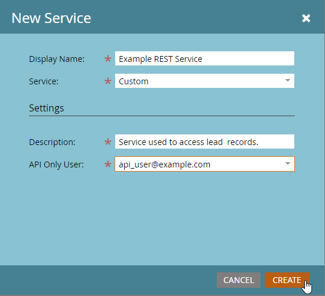

# 自定义服务

自定义服务提供用于通过Marketo进行身份验证的凭据。 需要凭据才能从Marketo [Identity服务](https://developer.adobe.com/marketo-apis/api/identity/#tag/Identity/operation/identityUsingGET)获取访问令牌。 每个自定义服务的作用范围限定于一个仅限API的用户，从该用户获取其权限。

## 角色

创建自定义服务的第一步是创建可应用于相关仅限API用户的角色。 此操作从&#x200B;**[!UICONTROL Admin]** > **[!UICONTROL Users & Roles]** > **[!UICONTROL Roles]**&#x200B;菜单完成。

角色是单个权限的容器，允许或限制对特定功能的访问。 在启用了工作区和分区的订阅中，将按工作区授予权限。 如果用户在一个工作区中拥有权限，但在另一个工作区中没有，则他们只能在该工作区中执行允许的操作。 要创建角色，请单击新建角色按钮。

请确保为您的角色提供一个描述性名称。 仅API用户具有一组特定的权限，这些权限与正常用户权限不同且互不相同。 API权限存在于“Access API”树下的其自己的层次结构中。

### 角色权限

仅“访问API”组中的权限适用于API用户，也就是说，授予所有管理员权限不会将任何API权限授予用户。

在构建角色时，请仔细考虑您应该允许应用程序使用该角色执行哪些操作。 仅授予执行这些操作所需的最低权限集。 允许不必要地授予权限集可允许集成在您的订阅中执行不需要的操作。 您可以使用[权限工具](endpoint-reference.md)确定最小权限集。 查看[权限](#permission_list)的完整列表。

## 用户

创建角色后，必须创建“仅限API”用户。 仅限API用户是Marketo中的一种特殊类型的用户，因为它们由其他用户管理，并且无法用于登录到Marketo。 仅API用户可以：

- 创建自定义服务
- 确定这些服务的权限范围
- 访问REST API

>[!MORELIKETHIS]
>
>要创建仅限API的用户，请转到&#x200B;**[!UICONTROL Admin]** > **[!UICONTROL Users & Roles]** > **[!UICONTROL Users]**&#x200B;菜单并单击[!UICONTROL Invite New User]。

根据用户将用于的服务和应用程序，为其提供描述性名称和电子邮件地址（不一定有效）。 填写对话框菜单中的必填字段，单击“仅限API”复选框，然后将您的某个API角色授予用户。 这会将该角色的权限集分配给用户。

最后，单击“发送”以创建仅限API的用户。

为应用程序设置凭据时，强烈考虑为该服务创建新用户，即使它与其他现有集成具有相同的权限集。 API调用使用情况统计信息和错误是按用户进行跟踪的，因此为每个应用程序预配用户可以帮助您将使用情况和问题隔离到特定应用程序。 如果您遇到与达到每日API调用限制有关的问题，或者由于集成进行的API调用而导致的错误，这将会很有用。

## 自定义服务

自定义服务提供使用Marketo实例执行身份验证所需的实际凭据、客户端ID和客户端密钥。 要预配一个，请转到您的&#x200B;**[!UICONTROL Admin]** > **[!UICONTROL Integrations]** > **[!UICONTROL LaunchPoint]**&#x200B;菜单，然后选择&#x200B;**[!UICONTROL New Service]**。

为您的服务提供一个描述性名称，然后从“服务”列表中选择“自定义”。 为服务提供详细描述，并从仅API用户列表中选择适当的用户，然后单击[!UICONTROL Create]。

这会向LaunchPoint服务列表中添加一个新服务，以及“查看详细信息”选项。 单击“查看详细信息”，系统会为您提供身份验证所需的客户端ID和客户端密钥、拥有的用户以及获取令牌以进行短期测试的选项。 从此对话框获得的令牌与通常从[Identity服务](https://developer.adobe.com/marketo-apis/api/identity/#tag/Identity/operation/identityUsingGET)获得的令牌的生命周期相同，在创建令牌后3,600秒内有效。

## 工作区和分区

在具有工作区和分区的订阅中，根据用户在给定工作区中的角色所具有的权限，授予访问给定记录或资产的能力。 每个工作区都可以访问“工作区和分区”菜单中的一个或多个分区，并且潜在客户属于单个分区。 如果仅API用户有权读取或写入工作区中的潜在客户记录，则它将能够访问该工作区有权访问的分区中的所有记录。

Assets属于工作区，因此读取或写入资源的能力取决于用户在相关工作区中是否具有有权在工作区中读取或写入该类型资源记录的角色。

## 权限列表

以下是仅限API用户可用的所有权限列表，以及他们允许具有此权限的用户执行的操作。

| 角色权限 | 授予对……的访问权限 |
| --- | --- |
| 批准Assets | 批准资源 |
| 执行营销活动 | 请求或计划营销活动 |
| 只读活动 | 检索潜在客户活动 |
| 只读活动元数据 | 检索潜在客户活动元数据 |
| 只读Assets | 检索资源详细信息 |
| 只读营销活动 | 检索营销活动详细信息 |
| 只读公司 | 检索公司详细信息 |
| 只读自定义对象 | 检索自定义对象详细信息 |
| 只读潜在客户 | 检索潜在客户详细信息 |
| 只读指定帐户 | 检索指定帐户详细信息 |
| 只读指定帐户列表 | 检索指定帐户列表详细信息 |
| 只读机会 | 检索机会详细信息 |
| 只读销售人员 | 检索销售人员详细信息 |
| 读写活动 | 检索和创建潜在客户活动 |
| 读写活动元数据 | 检索和创建潜在客户活动元数据 |
| 读写Assets | 检索、创建和更新资源 |
| 读写营销活动 | 检索、创建和更新营销活动 |
| 读写公司 | 检索、创建和更新公司 |
| 读写自定义对象 | 检索、创建和更新自定义对象 |
| 读写潜在客户 | 检索、创建和更新潜在客户详细信息 |
| 读写指定帐户 | 检索、创建和更新指定帐户 |
| 读写指定帐户列表 | 检索、创建和更新指定帐户列表 |
| 读写机会 | 检索、创建和更新机会 |
| 读写销售人员 | 检索、创建和更新销售人员 |
