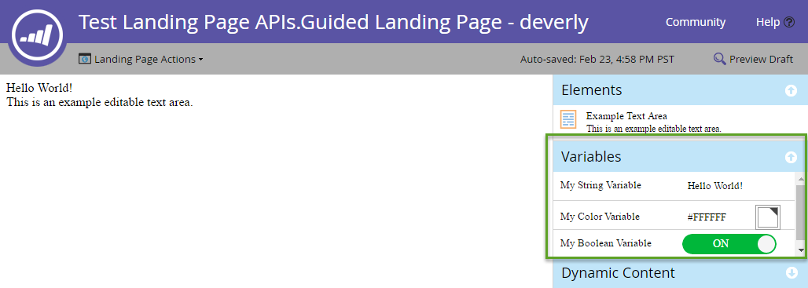

# 登陆页面

[登陆页面端点引用](https://developer.adobe.com/marketo-apis/api/asset/#tag/Landing-Pages)

登陆页面是Marketo托管的网页。

## 查询

与大多数其他资源一样，可以查询登陆页面 [按名称](https://developer.adobe.com/marketo-apis/api/asset/#tag/Landing-Pages/operation/getLandingPageByNameUsingGET)， [按id](https://developer.adobe.com/marketo-apis/api/asset/#tag/Landing-Pages/operation/getLandingPageByIdUsingGET)，并由 [浏览](https://developer.adobe.com/marketo-apis/api/asset/#tag/Landing-Pages/operation/browseLandingPagesUsingGET). 这些查询将仅返回元数据，并且登陆页面的内容部分列表必须按登陆页面的ID单独查询。

查询登陆页面的内容将返回登陆页面中可用的内容部分的列表。 部分必须存在于页面的内容列表中，才能更新内容：

```
GET /rest/asset/v1/landingPage/{id}/content.json
```

```json
{
    "success": true,
    "warnings": [],
    "errors": [],
    "requestId": "6307#154ea1689d7",
    "result": [
        {
            "id": "67",
            "type": "Form",
            "index": 1,
            "content": {
                "content": "189",
                "contentType": "Form",
                "contentUrl": "https://app-devlocal1.marketo.com/#FO189A1ZN13LA1"
            },
            "formattingOptions": {
                "zIndex": 15,
                "left": "359px",
                "top": "122px"
            }
        }
    ]
}
```

引导式登陆页面和自由表单模板的结果将有所不同，因为引导式登陆页面附带一组由派生它们的模板定义的节，而自由表单页面不附带预定义节，必须在编辑之前添加其内容。  请注意，“content”属性的格式可能因“type”属性以及字段是静态还是动态而异。

## 创建和更新

[创建登陆页面](https://developer.adobe.com/marketo-apis/api/asset/#tag/Landing-Pages/operation/createLandingPageUsingPOST) 通过引用回模板。 创建时，只需填写名称、模板（模板的ID）以及要将页面放入其中的文件夹字段。 有关可填充的其他元数据，请参阅端点引用。

有效的内容类型 [登陆页面内容](https://developer.adobe.com/marketo-apis/api/asset/#tag/Landing-Page-Content) 端点包括：富文本、HTML、表单、图像、矩形、代码片段。

```
POST rest/asset/v1/landingPages.json
```

```
Content-Type: application/x-www-form-urlencoded
```

```
name=createLandingPage&folder={"type": "Folder", "id": 11}&template=1&description=this is a test&workspace=default&title=test create&keywords=awesome&formPrefill=false
```

```json
{
    "success": true,
    "warnings": [],
    "errors": [],
    "requestId": "7a39#154cf7922c6",
    "result": [
        {
            "id": 27,
            "name": "createLandingPage",
            "description": "this is a test",
            "createdAt": "2016-05-20T18:41:43Z+0000",
            "updatedAt": "2016-05-20T18:41:43Z+0000",
            "folder": {
                "type": "Folder",
                "value": 11,
                "folderName": "Landing Pages"
            },
            "workspace": "Default",
            "status": "draft",
            "template": 1,
            "title": "test create",
            "keywords": "awesome",
            "robots": "index, nofollow",
            "formPrefill": false,
            "mobileEnabled": false,
            "URL": "https://app-devlocal1.marketo.com/lp/622-LME-718/createLandingPage.html",
            "computedUrl": "https://app-devlocal1.marketo.com/#LP27B2"
        }
    ]
}
```

可以使用更新登陆页面元数据 [更新登陆页面元数据端点](https://developer.adobe.com/marketo-apis/api/asset/#tag/Landing-Pages/operation/updateLandingPageUsingPOST).

## 审批

登陆页面遵循标准草稿批准模型，其中可以包含草稿版本和/或批准版本。 每当将更新应用于页面时，都会先将更新应用于草稿版本，并且仅在页面获得批准后才可实时查看。

## 删除

要删除登陆页面，必须首先使其无法使用、未被任何其他Marketo资源引用以及未被批准。 使用单独删除页面 [删除登陆页面](https://developer.adobe.com/marketo-apis/api/asset/#tag/Landing-Pages/operation/deleteLandingPageByIdUsingPOST) 端点。 无法通过此API删除嵌入了社交按钮的登陆页面。 

## 克隆

Marketo提供了一种克隆登陆页面的简单方法。 这是application/x-www-url-formencodedPOST请求。

此 `id` path参数指定要克隆的源登陆页的id。

此 `name` 参数用于指定新登陆页面的名称。

此 `folder` 参数用于指定从中创建新登陆页面的父文件夹。 其形式为嵌入JSON对象，包含 `id` 和 `type`.

此 `template` 参数用于指定源登陆页面模板id。

可选 `description` 参数用于描述新的登陆页面。

```
POST /rest/asset/v1/landingPage/{id}/clone.json
```

```
Content-Type: application/x-www-form-urlencoded
```

```
name=MyNewLandingPage&folder={"type":"Program","id":1119}&template=57
```

```json
{
    "success": true,
    "errors": [],
    "requestId": "1078d#1683e4881c6",
    "warnings": [],
    "result": [
        {
            "id": 3291,
            "name": "MyNewLandingPage",
            "createdAt": "2019-01-11T18:59:25Z+0000",
            "updatedAt": "2019-01-11T18:59:25Z+0000",
            "folder": {
                "type": "Program",
                "value": 1119,
                "folderName": "DefaultProgramWithGuidedLP"
            },
            "workspace": "Default",
            "status": "draft",
            "template": 57,
            "robots": "index, nofollow",
            "formPrefill": false,
            "mobileEnabled": false,
            "URL": "http://na-abm.marketo.com/lp/284-RPR-133/DefaultProgramWithGuidedLPPerkutoTestLP-Clone-1.html",
            "computedUrl": "https://app-abm.marketo.com/#LP3291A1LA1"
        }
    ]
}
```

## 管理内容部分

内容部分按其索引属性排序，并最终根据客户端显示时应用的CSS规则进行布局。 使用相应的包含和管理内容部分 [添加](https://developer.adobe.com/marketo-apis/api/asset/#tag/Landing-Page-Content/operation/addLandingPageContentUsingPOST)， [更新](https://developer.adobe.com/marketo-apis/api/asset/#tag/Landing-Page-Content/operation/updateLandingPageContentUsingPOST) 和 [删除](https://developer.adobe.com/marketo-apis/api/asset/#tag/Landing-Page-Content/operation/removeLandingPageContentUsingPOST) 登陆页面内容部分端点，并且可以使用以下项进行查询 [获取登陆页面内容](https://developer.adobe.com/marketo-apis/api/asset/#tag/Landing-Page-Content/operation/getLandingPageContentUsingGET). 每个部分都有一个类型和一个值参数。 类型确定应放入值中的内容。  对于这些端点，数据以x-www-form-urlencodedPOST传递，而不是以JSON格式传递。

**区域类型**

| 类型 | 值 |
|--- |--- |
| 动态内容 | 分段的ID。 |
| 表单 | 表单的ID。 |
| HTML | 文本HTML内容。 |
| 图像 | 图像资源的ID。 |
| 矩形 | 空。 |
| 富文本 | 文本HTML内容。  只能包含富文本元素。 |
| 代码片段 | 代码片段的id。 |
| 社交按钮 | 社交按钮的id。 |
| 视频 | 视频的id。 |

对于自由格式页面，必须添加所有所需的内容部分，并将使用id嵌入到div元素中 `mktoContent`. 对于引导式页面，预定义元素的列表可能出现在来自的列表中 [获取登陆页面内容](https://developer.adobe.com/marketo-apis/api/asset/#tag/Landing-Page-Content/operation/getLandingPageContentUsingGET) 端点。 可以添加更多内容或其 [内容已更新](https://developer.adobe.com/marketo-apis/api/asset/#tag/Landing-Page-Content/operation/updateLandingPageContentUsingPOST) 通过其各自的端点。

### 动态内容

要创建动态内容部分，该部分必须已存在于登陆页面的内容列表中。 此 [更新登陆页面内容部分](https://developer.adobe.com/marketo-apis/api/asset/#tag/Landing-Page-Content/operation/updateLandingPageContentUsingPOST) 然后，需要使用端点将类型设置为“DynamicContent”。 当某个部分设置为动态内容时，它会在内容部分中创建基础动态部分，这些部分都继承已转换元素的基本类型。 每个动态部分也会继承转化部分中的内容。

```
GET /rest/asset/v1/landingPage/{id}/dynamicContent/RVMtNDg=.json
```

```json
{
  "success": true,
  "warnings": [],
  "errors": [],
  "requestId": "46e#1560fa169d9",
  "result": [
    {
      "createdAt": "2016-07-21",
      "updatedAt": "2016-07-21",
      "segmentation": 1007,
      "segments": [
        {
          "segmentId": 1018,
          "segmentName": "Default",
          "type": "RichText",
          "content": "\n\t\t\t\t\t\t\tAlice was beginning to get very tired of sitting by her sister on the bank, and having nothing to do: once or twice she had peeped into the book her sister was reading, but it had no pictures or conversations in it.\n\t\t\t\t\t\t"
        },
        {
          "segmentId": 1017,
          "segmentName": "New Segment",
          "type": "RichText",
          "content": "\n\t\t\t\t\t\t\tAlice was beginning to get very tired of sitting by her sister on the bank, and having nothing to do: once or twice she had peeped into the book her sister was reading, but it had no pictures or conversations in it.\n\t\t\t\t\t\t"
        }
      ]
    }
  ]
}
```

[更新内容](https://developer.adobe.com/marketo-apis/api/asset/#tag/Landing-Page-Content/operation/updateLandingPageDynamicContentUsingPOST) 各独立分部乃按分部id基准。

```
POST /rest/asset/v1/landingPage/{id}/dynamicContent/{dynamicContentId}.json
```

```
Content-Type: application/x-www-form-urlencoded
```

```
segment=New Segment&value=New Content
```

```json
 {
  "success": true,
  "warnings": [],
  "errors": [],
  "requestId": "7516#14e08fe7cbbc",
  "result": [
    {
      "id": 1012
    }
  ]
}
```

## 变量

引导式登陆页面中引入的功能之一是可编辑变量。  变量包含登陆页面上元素的值。  可使用登陆页面编辑器轻松修改变量，如下所示：



变量在内被定义为元标记 `<head>` 引导模式登陆页面模板的元素。 提供了三种类型的变量：字符串、颜色和布尔值。  以下是三个变量定义的示例：

```html
<head>
  <meta charset="utf-8">
  <meta class="mktoString" mktoName="My String Variable" id="stringVar" default="Hello World!">
  <meta class="mktoColor" mktoName="My Color Variable" id="colorVar" default="#ffffff">
  <meta class="mktoBoolean" mktoName="My Boolean Variable" id="boolVar" default="true">
</head>
```

有关更多信息，请参阅中的“可编辑变量”部分。 [创建引导式登陆页面模板](https://experienceleague.adobe.com/en/docs/marketo/using/product-docs/demand-generation/landing-pages/landing-page-templates/create-a-guided-landing-page-template) 文档。

### 查询

通过将登陆页面ID传递到获取登陆页面变量端点，为引导式登陆页面检索变量。

```
GET /rest/asset/v1/landingPage/{id}/variables.json
```

```json
{
    "success": true,
    "warnings": [],
    "errors": [],
    "requestId": "10843#15a6d7e5fa1",
    "result": [
        {
            "id": "stringVar",
            "value": "Hello World!",
            "type": "string"
        },
        {
            "id": "colorVar",
            "value": "#FFFFFF",
            "type": "color"
        },
        {
            "id": "boolVar",
            "value": "true",
            "type": "boolean"
        }
    ]
}
```

在此示例中，引导式登陆页面包含3个变量：stringVar、colorVar、boolVar。

### 更新

通过将登陆页面ID、变量ID和变量值传递到“更新登陆页面变量”端点，更新引导式登陆页面的变量。

```
POST /rest/asset/v1/landingPage/{id}/variable/{variableId}.json?value={newValue}
```

```json
{
    "success": true,
    "warnings": [],
    "errors": [],
    "requestId": "2b07#15a6db77da3",
    "result": [
        {
            "id": "stringVar",
            "value": "Hello Brave New World!",
            "type": "String"
        }
    ]
}
```

## 预览登陆页面

Marketo提供 [获取登陆页面完整内容](https://developer.adobe.com/marketo-apis/api/asset/#tag/Landing-Pages/operation/getLandingPageFullContentUsingGET) 端点检索登陆页面的实时预览，因为它将在浏览器中呈现。 有一个必需的参数 `id` path参数，您希望预览的登陆页面的id。 另外还有两个可选查询参数：

- 分段：接受包含segmentationId和segmentId属性的JSON对象数组。 设置后，会预览登陆页面，就像您是匹配这些区段的潜在客户一样。
- leadId：接受商机的整数id。 设置后，会预览登陆页面，就像是由指定的潜在客户查看一样。

```
GET /rest/asset/v1/landingPage/{id}/fullContent.json?leadId=1001&segmentation=[{"segmentationId":1030,"segmentId":1103}]
```

```json
{
  "success": true,
  "errors": [],
  "requestId": "119ab#17692849f1e",
  "warnings": [],
  "result": [
    {
      "id": 1023,
      "content": "<!DOCTYPE html>\n<html>\n <head>\n <meta charset=\"utf-8\">\n \n \n <meta name=\"robots\" content=\"index, nofollow\">\n <title></title>\n <style>\n body {background:#FFFFFF} \n #myConditionalDisplayArea {\n display: true;\n }\n </style>\n <link rel=\"shortcut icon\" href=\"/favicon.ico\" type=\"image/x-icon\" >\n<link rel=\"icon\" href=\"/favicon.ico\" type=\"image/x-icon\" >\n\n\n<style>.mktoGen.mktoImg {display:inline-block; line-height:0;}</style>\n </head>\n <body id=\"bodyId\">\n \n Hello Brave New World!\n <div class=\"mktoText\" id=\"exampleText\"><div>This is an example editable text area.</div>\n<div>Lead Full Name = Hanna Crawford</div>\n<div><br /></div>\n <script type=\"text/javascript\" src=\"//munchkin.marketo.net//munchkin.js\"></script><script>Munchkin.init('123-ABC-456', {customName: 'Test-Landing-Page-APIs_Guided-Landing-Page---deverly', PURL_VISIT_TOKEN, wsInfo: 'j1RR'});</script>\n<div id=\"mktoClickBlockingDiv\"></div>\n </body>\n</html>\n"
    }
  ]
}
```
