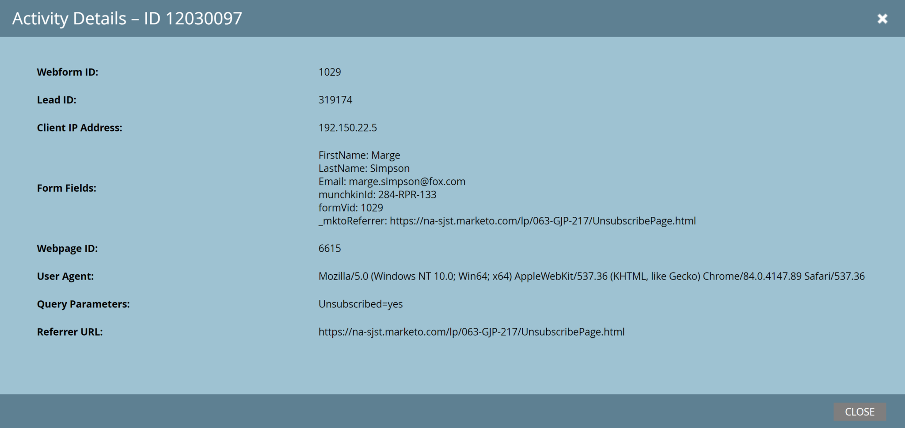

# 潜在客户

[潜在客户端点引用](https://developer.adobe.com/marketo-apis/api/mapi#tag/Leads)

Marketo潜在客户API支持对潜在客户记录执行CRUD操作。 您还可以修改潜在客户在静态列表和程序中的成员资格，并启动潜在客户的Smart Campaign处理。

## 描述

使用描述潜在客户检索通过REST API可用的字段以及每个字段的元数据：

- 数据类型
- REST API名称
- 长度（如果适用）
- 只读状态
- 友好标签

描述是字段可用性和元数据的主要真实来源。

### 请求

```http
GET /rest/v1/leads/describe.json
```

### 响应

```json
{
   "requestId":"37ca#1475b74e276",
   "success":true,
   "result":[
      {
         "id":2,
         "displayName":"Company Name",
         "dataType":"string",
         "length":255,
         "rest":{
            "name":"company",
            "readOnly":false
         },
         "soap":{
            "name":"Company",
            "readOnly":false
         }
      }
}
```

实际响应在结果数组中包含更多字段。 每个项目表示潜在客户记录中可用的字段，并至少包含id、displayName和数据类型。

只有当字段对相应的API有效时，才会显示rest和soap子对象。 `readOnly`属性指示相应的API是否可以更新该字段。 如果存在，length属性提供最大字段长度，而dataType属性提供字段的数据类型。

## 查询

使用以下两种主要方法之一检索潜在客户：

- 按ID获取商机：使用一个商机ID作为路径参数并返回一个商机记录。
- 按筛选器类型获取潜在客户查找选定字段与提供的值之一匹配的记录。

对于Get Lead by ID，可以选择传递一个字段参数，该参数包含要返回的以逗号分隔的字段名称列表。 如果请求省略了字段，则响应将包含`email`、`updatedAt`、`createdAt`、`lastName`、`firstName`和`id`。 如果未返回请求的字段，则其值默认为空。

### 请求

```http
GET /rest/v1/lead/{id}.json
```

### 响应

```json
{
   "requestId": "10226#14d3049e51b",
   "success": true,
   "result": [
      {
         "id": 318581,
         "updatedAt":"2015-05-07T11:47:30-08:00"
         "lastName": "Doe",
         "email": "jdoe@marketo.com",
         "createdAt": "2015-05-01T16:47:30-08:00",
         "firstName": "John"
      }
   ]
}
```

Get Lead by Id始终在结果数组的第一个位置返回一个记录。

按筛选器类型获取潜在客户会返回相同的记录类型，并且每页最多可返回300条记录。 `filterType`和`filterValues`查询参数是必需的。

`filterType`接受任何自定义字段和最常用的字段。 调用`Describe2`终结点以检索`filterType`允许的可搜索字段。 按自定义字段搜索时，支持的数据类型是`string`、`email`和`integer`。 使用Describe方法检索字段详细信息，如说明和类型。

`filterValues`接受最多300个逗号分隔值。 该调用会返回选定潜在客户字段与其中一个值匹配的记录。 如果超过1,000个潜在客户与过滤器匹配，则API返回“1003，有太多结果与过滤器匹配”。

如果GET请求总数超过8 KB，则API在RFC 7231下返回“414， URI过长”。 要解决此限制，请将GET更改为POST，添加_method=GET参数，并将查询字符串放入请求正文中。

### 请求

```http
GET /rest/v1/leads.json?filterType=id&filterValues=318581,318592
```

### 响应

```json
{
    "requestId": "12951#15699db5c97",
    "result": [
        {
            "id": 318581,
            "updatedAt": "2016-05-17T22:11:45Z",
            "lastName": "Lincoln",
            "email": "abe@usa.gov",
            "createdAt": "2015-03-17T00:18:40Z",
            "firstName": "Abraham"
        },
        {
            "id": 318592,
            "updatedAt": "2016-05-17T22:20:51Z",
            "lastName": "Washington",
            "email": "george@usa.gov",
            "createdAt": "2015-04-06T16:29:21Z",
            "firstName": "George"
        }
    ],
    "success": true
}
```

此调用返回其ID与`filterValues`中的值匹配的记录。

如果没有匹配的记录，则响应将指示成功，并包含空的结果数组。

### 响应

```json
{
"requestId": "177a1#1578b643357",
"result": [],
"success": true
}
```

按ID获取潜在顾客和按过滤器类型获取潜在顾客都接受字段查询参数，该参数包含以逗号分隔的API字段列表。 当字段存在时，每个响应记录都包括列出的字段。 如果忽略，则响应将包括`id`、`email`、`updatedAt`、`createdAt`、`firstName`和`lastName`。

## ADOBE ECID

启用Adobe Experience Cloud受众共享后，Cookie同步会将Adobe Experience Cloud ID (ECID)值与Marketo潜在客户关联。 若要使用前面的潜在客户检索方法检索关联的ECID值，请在字段参数中包含`ecids`。 例如：`&fields=email,firstName,lastName,ecids`。

## 创建和更新

潜在客户API可以创建、更新和删除潜在客户记录。 创建和更新操作使用相同的端点，并在请求中定义操作类型。 一个请求最多可创建或更新300条记录。

>[!NOTE]
>
> 不支持使用[同步潜在客户](https://developer.adobe.com/marketo-apis/api/mapi#tag/Leads/operation/syncLeadUsingPOST)终结点更新公司字段。 请改用[同步公司](https://developer.adobe.com/marketo-apis/api/mapi#tag/Companies/operation/syncCompaniesUsingPOST)终结点。

>[!NOTE]
>
> 创建或更新人员记录的电子邮件值时，电子邮件地址字段仅支持ASCII字符。

### 请求

```http
POST /rest/v1/leads.json
```

### 正文

```json
{
   "action":"createOnly",
   "lookupField":"email",
   "input":[
      {
         "email":"kjashaedd-1@klooblept.com",
         "firstName":"Kataldar-1",
         "postalCode":"04828"
      },
      {
         "email":"kjashaedd-2@klooblept.com",
         "firstName":"Kataldar-2",
         "postalCode":"04828"
      },
      {
         "email":"kjashaedd-3@klooblept.com",
         "firstName":"Kataldar-3",
         "postalCode":"04828"
      }
   ]
}
```

### 响应

```json
{
   "requestId":"e42b#14272d07d78",
   "success":true,
   "result":[
      {
         "id":50,
         "status":"created"
      },
      {
         "id":51,
         "status":"created"
      },
      {
         "id":52,
         "status":"created"
      }
   ]
}
```

该请求使用两个重要字段：

- `action`指定了操作类型： `createOrUpdate`、`createOnly`、`updateOnly`或`createDuplicate`。 如果忽略，则默认为`createOrUpdate`。
- `lookupField`指定操作为`createOrUpdate`或`updateOnly`时的键。 如果忽略，则默认为`email`。

缺省情况下，该操作使用缺省分区。 可选`partitionName`参数仅在操作为`createOnly`或`createOrUpdate`时有效。 若要使用`partitionName`作为其他重复数据删除条件，请将其包含在自定义重复数据删除规则的源类型中。

在更新期间，如果指定的分区中不存在潜在客户，或者仅API用户无法访问该分区，则API会返回错误。

由于`id`是系统管理的唯一键，因此请仅将其包含在`updateOnly`操作中。

该请求必须包含包含包含潜在客户记录数组的`input`参数。 每个潜在客户记录都是一个JSON对象，其中包含任意数量的潜在客户字段。 每个记录中的键必须唯一，并且所有JSON字符串都必须使用UTF-8编码。

使用`externalCompanyId`将潜在客户记录链接到公司记录。 使用`externalSalesPersonId`将潜在客户记录链接到销售人员记录。

如果多个请求在第一个请求返回之前使用相同的键值，则并发或接近定时的upsert请求可能会创建重复记录。 要防止出现重复项，请根据需要使用`createOnly`或`updateOnly`。 或者，先将调用排入队列，然后等待每个调用返回，然后再使用相同的键提交另一个更新插入。

## 字段

潜在客户对象包含标准字段和可选自定义字段。 每个Marketo Engage订阅中都存在标准字段，而用户会根据需要创建自定义字段。

每个字段定义包含元数据属性，例如显示名称、API名称和数据类型。

使用以下端点查询、创建和更新潜在客户对象的字段。 API用户的角色必须具有读写架构标准字段权限和/或读写架构自定义字段权限。

## 查询字段

按API名称查询一个潜在客户字段或查询所有潜在客户字段。 根据角色权限，响应可能包括标准字段、自定义字段和隐藏字段。

## 按名称

“按名称获取潜在客户字段”端点可检索一个潜在客户字段的元数据。 必填的fieldApiName路径参数指定字段的API名称。

响应类似于Describe Lead响应，但包含其他元数据。 例如，isCustom属性指示字段是否为自定义字段。

### 请求

```http
GET /rest/v1/leads/schema/fields/{fieldApiName}.json
```

### 响应

```json
{
    "requestId": "cd97#1793ee0fec4",
    "result": [
        {
            "displayName": "Email Address",
            "name": "email",
            "description": null,
            "dataType": "email",
            "length": 255,
            "isHidden": false,
            "isHtmlEncodingInEmail": true,
            "isSensitive": true,
            "isCustom": false
        }
    ],
    "success": true
}
```

## 浏览

获取潜在客户字段端点检索潜在客户对象中所有字段的元数据。 默认情况下，它最多返回300条记录。 使用`batchSize`查询参数减少此数量。

如果`moreResult`为true，则有更多结果可用。 在随后的每次调用中传递返回的`nextPageToken`，直到`moreResult`为false。

### 请求

```http
GET /rest/v1/leads/schema/fields.json
```

### 响应（已截断）

```json
{
    "requestId": "142c3#1793eb976d8",
    "result": [
        {
            "displayName": "Salutation",
            "name": "salutation",
            "description": null,
            "dataType": "string",
            "length": 255,
            "isHidden": false,
            "isHtmlEncodingInEmail": true,
            "isSensitive": true,
            "isCustom": false
        },
        {
            "displayName": "First Name",
            "name": "firstName",
            "description": null,
            "dataType": "string",
            "length": 255,
            "isHidden": false,
            "isHtmlEncodingInEmail": true,
            "isSensitive": true,
            "isCustom": false
        },
        {
            "displayName": "Middle Name",
            "name": "middleName",
            "description": null,
            "dataType": "string",
            "length": 255,
            "isHidden": false,
            "isHtmlEncodingInEmail": true,
            "isSensitive": true,
            "isCustom": false
        },
        {
            "displayName": "Last Name",
            "name": "lastName",
            "description": null,
            "dataType": "string",
            "length": 255,
            "isHidden": false,
            "isHtmlEncodingInEmail": true,
            "isSensitive": true,
            "isCustom": false
        },
        {
            "displayName": "Date of Birth",
            "name": "dateOfBirth",
            "description": null,
            "dataType": "date",
            "isHidden": false,
            "isHtmlEncodingInEmail": false,
            "isSensitive": true,
            "isCustom": false
        },
        {
            "displayName": "Email Address",
            "name": "email",
            "description": null,
            "dataType": "email",
            "length": 255,
            "isHidden": false,
            "isHtmlEncodingInEmail": true,
            "isSensitive": true,
            "isCustom": false
        },
        {
            "displayName": "Phone Number",
            "name": "phone",
            "description": null,
            "dataType": "phone",
            "length": 255,
            "isHidden": false,
            "isHtmlEncodingInEmail": true,
            "isSensitive": true,
            "isCustom": false
        },
        {
            "displayName": "Mobile Phone Number",
            "name": "mobilePhone",
            "description": null,
            "dataType": "phone",
            "length": 255,
            "isHidden": false,
            "isHtmlEncodingInEmail": true,
            "isSensitive": true,
            "isCustom": false
        },
        {
            "displayName": "Fax Number",
            "name": "fax",
            "description": null,
            "dataType": "phone",
            "length": 255,
            "isHidden": false,
            "isHtmlEncodingInEmail": true,
            "isSensitive": true,
            "isCustom": false
        },
        {
            "displayName": "Job Title",
            "name": "title",
            "description": null,
            "dataType": "string",
            "length": 255,
            "isHidden": false,
            "isHtmlEncodingInEmail": true,
            "isSensitive": true,
            "isCustom": false
        },
        {
            "displayName": "Unsubscribed",
            "name": "unsubscribed",
            "description": null,
            "dataType": "boolean",
            "isHidden": false,
            "isHtmlEncodingInEmail": false,
            "isSensitive": true,
            "isCustom": false
        },
        ...
    ],
    "success": true,
    "moreResult": false
}
```

## 创建字段

“创建潜在客户字段”端点在潜在客户对象中创建一个或多个自定义字段，并提供与Marketo Engage UI类似的功能。 您可以使用此端点创建最多100个自定义字段。

在生产实例中创建字段之前，请仔细考虑每个字段。 创建字段后，您可以隐藏该字段，但不能将其删除。 未使用的字段会为实例添加待筛选项。

所需的输入参数是潜在客户字段对象的数组。 每个对象都需要以下属性：

- `displayName`是字段的UI显示名称。
- `name`是字段的API名称。
- `dataType`是字段类型。

可选属性为`description`、`isHidden`、`isHtmlEncodingInEmail`和`isSensitive`。

name属性必须是唯一的，以字母开头，并且只包含字母、数字或下划线。 `displayName`必须是唯一的，并且不能包含特殊字符。

常用惯例将驼峰式大小写应用于`displayName`以生成名称。 例如，“我的自定义字段”的`displayName`生成名称“myCustomField”。

### 请求

```http
POST /rest/v1/leads/schema/fields.json
```

### 正文

```json
{
  "input": [
      {
        "displayName": "Acme Access Code",
        "name": "acmeAccessCode",
        "description": "Acme Direct Mail Integration",
        "dataType": "string"
      },
      {
        "displayName": "Acme Mail Date",
        "name": "acmeMailDate",
        "description": "Acme Direct Mail Integration",
        "dataType": "string"
      }
  ]
}
```

### 响应

```json
{
    "requestId": "d9f1#17943666811",
    "result": [
        {
            "name": "acmeAccessCode",
            "status": "created"
        },
        {
            "name": "acmeMailDate",
            "status": "created"
        }
    ],
    "success": true
}
```

## 更新字段

“更新潜在客户字段”端点会更新潜在客户对象上的一个自定义字段。 Marketo Engage UI中提供的大多数字段更新也可通过API获得。 下表总结了二者的差异。

<table>
<tbody>
<tr>
<td style="width: 26.5306%;" rowspan="2"><strong>属性</strong></td>
<td style="width: 35%;" colspan="2"><strong>标准字段</strong></td>
<td style="width: 38.2654%;" colspan="2"><strong>自定义字段</strong></td>
</tr>
<tr>
<td style="width: 17.449%;"><strong>可由API更新？</strong></td>
<td style="width: 17.551%;"><strong>可通过UI更新？</strong></td>
<td style="width: 19.3878%;"><strong>可由API更新？</strong></td>
<td style="width: 18.8776%;"><strong>可通过UI更新？</strong></td>
</tr>
<tr>
<td style="width: 26.5306%;">数据类型</td>
<td style="width: 17.449%;">否</td>
<td style="width: 17.551%;">否</td>
<td style="width: 19.3878%;">否</td>
<td style="width: 18.8776%;">是</td>
</tr>
<tr>
<td style="width: 26.5306%;">描述</td>
<td style="width: 17.449%;">是</td>
<td style="width: 17.551%;">是</td>
<td style="width: 19.3878%;">是</td>
<td style="width: 18.8776%;">是</td>
</tr>
<tr>
<td style="width: 26.5306%;">显示名称</td>
<td style="width: 17.449%;">否</td>
<td style="width: 17.551%;">否</td>
<td style="width: 19.3878%;">是</td>
<td style="width: 18.8776%;">是</td>
</tr>
<tr>
<td style="width: 26.5306%;">isCustom</td>
<td style="width: 17.449%;">否</td>
<td style="width: 17.551%;">否</td>
<td style="width: 19.3878%;">否</td>
<td style="width: 18.8776%;">否</td>
</tr>
<tr>
<td style="width: 26.5306%;">isHidden</td>
<td style="width: 17.449%;">否</td>
<td style="width: 17.551%;">是</td>
<td style="width: 19.3878%;">是（如果由API创建）</td>
<td style="width: 18.8776%;">是</td>
</tr>
<tr>
<td style="width: 26.5306%;">isHtmlEncodingInEmail</td>
<td style="width: 17.449%;">是</td>
<td style="width: 17.551%;">是</td>
<td style="width: 19.3878%;">是</td>
<td style="width: 18.8776%;">是</td>
</tr>
<tr>
<td style="width: 26.5306%;">isSensitive</td>
<td style="width: 17.449%;">是</td>
<td style="width: 17.551%;">是</td>
<td style="width: 19.3878%;">是</td>
<td style="width: 18.8776%;">是</td>
</tr>
<tr>
<td style="width: 26.5306%;">length</td>
<td style="width: 17.449%;">否</td>
<td style="width: 17.551%;">否</td>
<td style="width: 19.3878%;">否</td>
<td style="width: 18.8776%;">否</td>
</tr>
<tr>
<td style="width: 26.5306%;">name</td>
<td style="width: 17.449%;">否</td>
<td style="width: 17.551%;">否</td>
<td style="width: 19.3878%;">否</td>
<td style="width: 18.8776%;">否</td>
</tr>
</tbody>
</table>

所需的`fieldApiName`路径参数指定要更新的字段的API名称。 必需的输入参数是一个数组，其中包含具有一个或多个属性的一个潜在客户字段对象。

### 请求

```http
POST /rest/v1/leads/schema/fields/{fieldApiName}.json
```

### 正文

```json
{
  "input": [
      {
        "displayName": "Acme Access Code",
        "description": "Acme Direct Mail Integration",
        "isHtmlEncodingInEmail": true
      }
  ]
}
```

### 响应

```json
{
    "requestId": "9f57#1794324f44c",
    "result": [
        {
            "name": "acmeAccessCode",
            "status": "updated"
        }
    ],
    "success": true
}
```

## 将潜在客户推送到Marketo

推送潜在客户是同步潜在客户的替代方法，它提供了更多触发选项，类似于Marketo表单。 除了同步潜在客户字段之外，端点还可以根据Cookie值关联潜在客户。 传递通过Marketo电子邮件中的点击生成的`mkt_tok`值，或者在调用中传递程序名称。

端点还会创建一个与Marketo项目、营销策划或两者关联的可触发活动。 使用此活动从归因于特定活动或项目的商机捕获事件启动工作流。

推送潜在客户使用与同步潜在客户相同的主键和字段API名称。 它没有操作参数，因为它始终执行upsert。

`programName`和输入参数是必需的。 输入参数是一个潜在客户对象数组，生成的活动将归因于指定的程序。 `lookupField`、`source`和`reason`参数是可选的。 在`source`和`reason`中添加任意字符串以在生成的活动中包括这些值。 您可以将这些值用作相应触发器（潜在客户被推送到Marketo）和过滤器（潜在客户被推送到Marketo）中的约束。

要将以前的匿名活动与新创建的潜在客户关联，请在潜在客户对象中忽略Cookie属性，并在推送潜在客户后调用Associate Lead 。 要创建没有活动历史的销售线索，请在销售线索对象中指定Cookie属性。

### 请求

```http
POST /rest/v1/leads/push.json
```

### 正文

```json
{
    "programName": "Big Blue Thing Product Launch",
    "source": "Cool Sales Site",
    "reason": "Downloaded pricing sheet",
    "lookupField": "email",
    "input": [
        {
             "email": "Theresa.May@westminister.gov.uk",
             "country": "united kingdom",
             "firstName": "Theresa",
             "website": "www.brexit.com",
             "leadScore": 45,
             "jobTitle": "Prime Minister"
         },
         {
             "email": "Justin.Trudeau@ottowa.gov.ca",
             "country": "canada",
             "firstName": "Justin",
             "website": "www.take-off-eh.com",
             "leadScore": 92,
             "jobTitle": "Sonny"
         }
     ]
}
```

### 响应

```json
{
    "requestId": "939079529805",
    "success": true,
    "warnings": [],
    "result": [
       {
           "id": 483894,
           "status": "created"
       },
       {
           "id": 1087425,
           "status": "updated"
       },
       {
           "id": 3525,
           "reasons": [
                    {
                        "code": "501",
                        "message": "Bad stuff happened"
                    }
           ]
       }
    ]
}
```

要传递`mkt_tok`参数，请将其值分配给输入参数内潜在客户记录中的mktToken成员。

### 正文

```json
{
  "programName": "Big Blue Thing Product Launch",
  "source": "Cool Sales Site",
  "reason": "Downloaded pricing sheet",
  "lookupField": "mktToken",
  "input" : [
     {
       "mktToken" : "<tokenValue>",
       "firstName" : "Thelma"
     },
     {
       "mktToken" : "<tokenValue>",
       "firstName" : "Louise"
     }
   ]
}
```

## 提交表单

提交表单是同步潜在客户的替代方法，它提供的功能等效于Marketo表单提交。 使用它从归因于特定活动或项目的商机捕获事件启动工作流。

提交表单端点支持以下功能：

- 使用电子邮件字段作为主键更新插入潜在客户记录。
- 创建与项目、营销策划或两者关联的“填写表单”活动。
- 根据Cookie值关联潜在客户。
- 验证表单字段。

使用标准商机数据库模式提交表单。 在POST请求的JSON正文的必需输入成员中传递一个对象记录。 所需的`formId`成员包含目标Marketo表单ID。

使用可选`programId`标识接收潜在客户和/或项目成员自定义字段的程序。 如果存在`programId`，则潜在客户将连同表单中的任何项目群成员字段一起添加到项目中。 程序必须与表单位于同一工作区中。

如果该表单不包含项目群成员自定义字段并且省略了`programId`，则不会将潜在客户添加到项目中。 如果表单属于程序，包含一个或多个程序成员自定义字段，并省略`programId`，则端点将使用该表单的程序。

所需的`leadFormFields`对象包含一个或多个要填充的字段的名称/值对。 每个字段都必须以指定的形式定义，并且每个名称必须是字段的REST API名称。 `email`字段为必填项。

可选的`visitorData`对象包含页面访问数据，包括`pageURL`、`queryString`、`leadClientIpAddress`和`userAgentString`。 使用它填充过滤器和触发器的其他活动字段。

可选Cookie成员将Munchkin Cookie与Marketo人员记录关联。 端点创建潜在客户时，会将之前的匿名活动与该潜在客户关联，除非该Cookie之前与其他已知记录关联。

如果以前关联过Cookie，则系统会根据新记录跟踪新活动，但旧活动会保留现有已知记录。 要创建没有活动历史的销售线索，请忽略Cookie成员。

在窗体所在的工作区的主分区中创建新的潜在客户。

### 请求

```http
POST /rest/v1/leads/submitForm.json
```

### 标头

```text
Content-Type: application/json
```

### 正文

```json
{
  "formId": 1029,
  "input": [
    {
      "leadFormFields": {
        "firstName": "Marge",
        "lastName": "Simpson",
        "email": "marge.simpson@fox.com",
        "pMCFField": "PMCF value"
      },
      "visitorData": {
        "pageURL": "https://na-sjst.marketo.com/lp/063-GJP-217/UnsubscribePage.html",
        "queryString": "Unsubscribed=yes",
        "leadClientIpAddress": "192.150.22.5",
        "userAgentString": "Mozilla/5.0 (Windows NT 10.0; Win64; x64) AppleWebKit/537.36 (KHTML, like Gecko) Chrome/84.0.4147.89 Safari/537.36"
      },
      "cookie": "id:063-GJP-217&token:_mch-marketo.com-1594662481190-60776"
    }
  ]
}
```

### 响应

```json
{
  "requestId": "10667#173bc585ca5",
  "result": [
    {
      "id": 319174,
      "status": "updated"
    }
  ],
  "success": true
}
```

下图显示了Marketo Engage UI中相应的“填写表单”活动详细信息：



## 合并

>[!NOTE]
>
>从2026年3月31日开始，在合并潜在客户API调用的`leadIds`参数中包含超过25个ID的调用将导致1080错误代码，并且将跳过该调用。 需要将超过25条记录合并为一个的工作应该被分割成多个工作以确保这些调用成功。
>

使用合并潜在客户API将重复记录合并到一个记录中。 合并可组合活动日志、项目、营销策划和列表成员资格、CRM信息和字段值。

将入选商机ID作为路径参数传递。 传递一个`leadId`作为查询参数，或在`leadIds`参数中传递最多25个逗号分隔ID。


### 请求

```http
POST /rest/v1/leads/{id}/merge.json?leadId=1324
```

### 响应

```json
{
   "requestId":"e42b#14272d07d78",
   "success":true
}
```

path参数中的商机是入选商机。 当字段值冲突时，合并使用入选者的值，除非该值为空并且丢失记录的值不为空。 `leadId`或`leadIds`参数中的潜在客户是失败的潜在客户。

对于启用SFDC-sync的订阅，使用`mergeInCRM`参数也可以在CRM中执行合并。 如果两个记录都在SFDC中，并且一个记录是CRM潜在客户，而另一个记录是CRM联系人，则无论指定的入选者是谁，CRM联系人都会入选。 如果一个记录在SFDC中，而另一个记录仅存在于Marketo中，则SFDC领先优势将获胜，而不管指定的入选者是谁。

## 关联Web活动

潜在客户跟踪(Munchkin)记录访客对您的网站和Marketo登陆页面的访问次数和点击次数。 这些活动使用与潜在客户浏览器中的“_mkto_trk”Cookie对应的键，从而允许Marketo跟踪同一人员的活动。

当潜在客户遵循Marketo电子邮件中的链接或提交Marketo表单时，通常会发生与潜在客户记录的关联。 要关联其他类型事件之后的潜在客户，请使用“关联潜在客户”端点。 将已知的潜在客户记录ID作为路径参数传递，并在Cookie查询参数中传递“_mkto_trk”Cookie值。

### 请求

```http
POST /rest/v1/leads/{id}/associate.json?cookie=id:287-GTJ-838%26token:_mch-marketo.com-1396310362214-46169
```

### 响应

```json
{
   "requestId":"e42b#14272d07d78",
   "success":true
}
```

如果该Cookie已与某个已知潜在客户关联，则对另一个潜在客户使用此API会针对新记录记录记录新的Web活动。现有Web活动未移至新记录。
会员资格

根据静态列表或计划中的成员资格检索潜在客户记录。 您还可以检索包含特定商机的所有静态列表、项目或智能营销活动。

响应结构和可选参数与“按筛选器类型获取潜在客户”匹配，但此API不接受`filterType`或`filterValues`。

要在Marketo UI中查找列表ID，请导航到列表并检查其URL。 在`https://app-****.marketo.com/#ST1001A1`中，1001是列表`id`。

## 按潜在客户ID获取计划

### 请求

```http
GET /rest/v1/list/{listId}/leads.json?batchSize=3
```

### 响应

```json
{
   "requestId":"e42b#14272d07d78",
   "success":true,
   "nextPageToken":
"PS5VL5WD4UOWGOUCJR6VY7JQO2KUXL7BGBYXL4XH4BYZVPYSFBAONP4V4KQKN4SSBS55U4LEMAKE6===",
    "result":[
       {
            "id":50,
            "email":"kjashaedd@klooblept.com",
            "firstName":"Kataldar",
             "postalCode":"04828"
       },
       {
           "id":2343,
           "email":"kjashaedd@klooblept.com",
           "firstName":"Kataldar",
           "postalCode":"04828"
       },
      {
           "id":88498,
           "email":"kjashaedd@klooblept.com",
           "firstName":"Kataldar",
         "postalCode":"04828"
         }
    ]
}
```

## 按潜在客户ID获取列表

“按潜在客户ID获取列表”端点采用潜在客户记录`id`路径参数并返回包括潜在客户的每个静态列表。

### 请求

```http
GET /rest/v1/leads/{id}/listMembership.json?batchSize=3
```

### 响应

```json
{
    "requestId": "1184b#1706f0ec23f",
    "result": [
        {
            "listId": 3379,
            "createdAt": "2016-05-17T19:32:44Z",
            "updatedAt": "2016-05-17T19:32:44Z"
        },
        {
            "listId": 2792,
            "createdAt": "2009-05-19T18:29:15Z",
            "updatedAt": "2009-05-19T18:29:15Z"
        },
        {
            "listId": 42,
            "createdAt": "2009-04-22T19:24:22Z",
            "updatedAt": "2009-04-22T19:24:22Z"
        }
    ],
    "success": true,
    "nextPageToken": "BFRV7OMVSNJWDVKVTUFS3XHT4E======",
    "moreResult": true
}
```

## 项目

检索计划成员资格的方式与列表成员资格相同。 按项目ID获取潜在客户接受相同的可选请求参数，并需要`programId`路径参数。

或者，传递包含以逗号分隔的字段名称列表的字段参数。 如果忽略字段，则响应将包括`email`、`updatedAt`、`createdAt`、`lastName`、`firstName`、`membership`和`id`。 如果未返回请求的字段，则其值默认为空。

结果数组中的每一项都是一个潜在客户，其子对象名为“membership”。 此对象描述潜在客户与所请求程序的关系，并始终包含`progressionStatus`、`acquiredBy`、`reachedSuccess`和`membershipDate`。

如果父计划是参与计划，则成员资格还包括用于描述潜在客户在该计划中的位置和活动的`stream`、`nurtureCadence`和`isExhausted`。

### 请求

```http
GET /rest/v1/leads/programs/{programId}.json?batchSize=3
```

### 响应

```json
{
    "requestId": "13ad4#1727b748a17",
    "result": [
        {
            "id": 319141,
            "firstName": "Meera",
            "lastName": "Reed",
            "email": "mree@housestark.com",
            "updatedAt": "2020-04-21T16:27:14Z",
            "createdAt": "2020-04-21T16:27:14Z",
            "membership": {
                "id": 1127,
                "progressionStatus": "Visited",
                "progressionStatusType": "Visited",
                "isExhausted": false,
                "acquiredBy": true,
                "reachedSuccess": false,
                "membershipDate": "2020-04-21T16:27:16Z",
                "updatedAt": "2020-04-21T16:27:16Z"
            }
        },
        {
            "id": 319142,
            "firstName": "Jon",
            "lastName": "Umber",
            "email": "jumb@housestark.com",
            "updatedAt": "2020-04-21T16:27:14Z",
            "createdAt": "2020-04-21T16:27:14Z",
            "membership": {
                "id": 1127,
                "progressionStatus": "Visited",
                "progressionStatusType": "Visited",
                "isExhausted": false,
                "acquiredBy": true,
                "reachedSuccess": false,
                "membershipDate": "2020-04-21T16:27:16Z",
                "updatedAt": "2020-04-21T16:27:16Z"
            }
        },
        {
            "id": 319143,
            "firstName": "Lyanna",
            "lastName": "Mormont",
            "email": "lmor@housestark.com",
            "updatedAt": "2020-04-21T16:27:14Z",
            "createdAt": "2020-04-21T16:27:14Z",
            "membership": {
                "id": 1127,
                "progressionStatus": "Visited",
                "progressionStatusType": "Visited",
                "isExhausted": false,
                "acquiredBy": true,
                "reachedSuccess": false,
                "membershipDate": "2020-04-21T16:27:16Z",
                "updatedAt": "2020-04-21T16:27:16Z"
            }
        }
    ],
    "success": true,
    "nextPageToken": "SW3PTMBVFCNHSHJGZ7LQH3ZWNUOHKADJZ3MOQ2LOZZVNO3WEIUPDKPRTTHBSMW756KOCWURTOF2XS==="
}
```

“按潜在客户ID获取程序”端点采用潜在客户记录ID路径参数，并返回包括潜在客户的每个程序。 使用可选的`filterType`和`filterValues`参数根据程序ID进行筛选。

### 请求

```http
GET /rest/v1/leads/{id}/programMembership.json
```

### 响应

```json
{
    "requestId": "12e84#1706f13a379",
    "result": [
        {
            "id": 1044,
            "progressionStatus": "Sent",
            "isExhausted": false,
            "acquiredBy": false,
            "reachedSuccess": false,
            "membershipDate": "2016-05-27T19:50:29Z",
            "updatedAt": "2016-05-27T19:50:29Z"
        }
    ],
    "success": true,
    "moreResult": false
}
```

## 智能营销活动

按商机ID获取智能营销活动端点采用商机记录ID路径参数，并返回包括商机的每个智能营销活动。

### 请求

```http
GET /rest/v1/leads/{id}/smartCampaignMembership.json?batchSize=3
```

### 响应

```json
{
    "requestId": "e7b0#1706f163632",
    "result": [
        {
            "smartCampaignId": 3746,
            "createdAt": "2018-06-01T18:00:04Z",
            "updatedAt": "2018-06-01T18:00:06Z"
        },
        {
            "smartCampaignId": 3678,
            "createdAt": "2015-04-06T18:37:30Z",
            "updatedAt": "2015-04-06T18:37:41Z"
        },
        {
            "smartCampaignId": 3680,
            "createdAt": "2015-04-06T18:37:30Z",
            "updatedAt": "2015-04-06T18:37:40Z"
        }
    ],
    "success": true,
    "nextPageToken": "TNGAH3NKDUFDHNXUVGTNBXJCQM======",
    "moreResult": true
}
```

## 删除

使用“删除潜在客户”端点可删除潜在客户记录。 在正文中通过id属性指定潜在客户id。 一个请求最多可以删除300个潜在客户。 发送Content-Type： application/json标头。

### 请求

```http
POST /rest/v1/leads/delete.json
```

### 正文

```json
{
   "input":[
      {
         "id": 235
      },
      {
         "id":766
      }
   ]
}
```

### 响应

```json
{
  "requestId":"3608#16664333670",
  "result":[
    {
      "id":235,
      "status":"deleted"
    },
    {
      "id":766,
      "status":"deleted"
    }
  ],
  "success":true
}
```

## 关系

- 公司通过潜在客户记录上的externalCompanyId字段
- 通过潜在客户记录上的externalSalesPersonId字段的SalesPerson
- 通过计划成员资格的计划
- 通过列表成员资格列出的列表
- 通过活动中的leadId字段进行的活动
- 通过潜在客户记录上的单个区段字段进行分段
- 通过潜在客户记录上的leadPartitionId字段进行分区

## 超时

潜在客户端点的超时为30秒，以下端点除外：

- 同步潜在客户：90秒
- 关联潜在客户：60多岁
- 合并潜在客户：180秒
- 更新潜在客户分区： 60秒
- 将潜在客户推送到Marketo：90多岁
- 按筛选器类型获取潜在客户：60秒
- 按列表ID获取潜在客户：60秒
