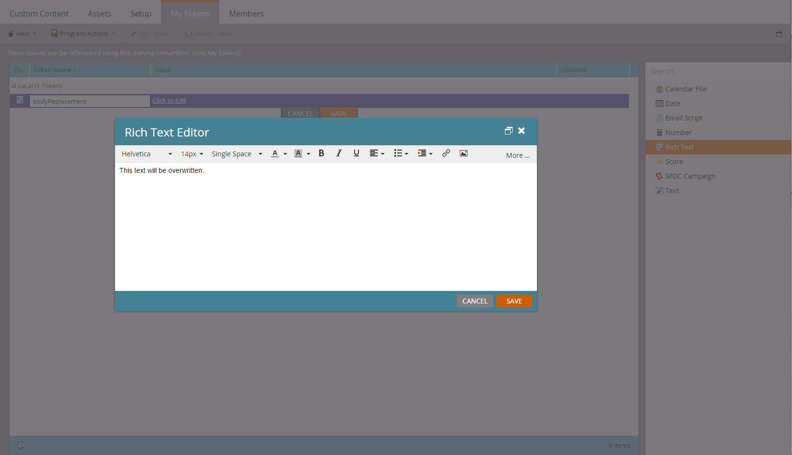

# 事务性电子邮件

Marketo API的常见用例是，通过触发向特定记录发送事务性电子邮件 [请求营销活动](https://developer.adobe.com/marketo-apis/api/mapi/#tag/Campaigns/operation/triggerCampaignUsingPOST) API调用。 Marketo中有一些配置要求使用Marketo REST API执行所需的调用。

- 收件人必须在Marketo中拥有记录
- 您的Marketo实例中必须已创建和批准事务型电子邮件。
- 必须有一个活动触发器营销活动，其名称为“Campaign is Requested， 1. 来源：Web服务API”，设置为发送电子邮件

第一 [创建和批准您的电子邮件](https://experienceleague.adobe.com/docs/marketo/using/home.html?lang=zh-Hans). 如果电子邮件确实是事务性的，则您可能必须将其设置为可操作，但请确保它符合可操作的合法资格。 可使用电子邮件操作>电子邮件设置下的编辑屏幕对此进行配置：


批准该活动，我们就可以创建我们的营销活动了：


如果您是创建营销活动的新手，请查看 [创建新的Smart Campaign](https://experienceleague.adobe.com/docs/marketo/using/product-docs/core-marketo-concepts/smart-campaigns/creating-a-smart-campaign/create-a-new-smart-campaign.html) 文章。 创建活动后，我们必须完成这些步骤。 使用Campaign is Requested触发器配置智能列表：


现在，我们必须配置流程以将“发送电子邮件”步骤指向我们的电子邮件：


在激活之前，您必须在“计划”选项卡中决定某些设置。 如果此特定电子邮件只应发送给给定记录一次，则保留资格设置。 但是，如果要求他们多次接收电子邮件，则您需要将此调整为每次接收一次或一个可用频率：

现在我们可以激活了：


## 发送API调用

**注意：** 在下面的Java示例中，我们使用 [最小json包](https://github.com/ralfstx/minimal-json) 在我们的代码中处理JSON呈现。

通过API发送事务型电子邮件的第一部分是，确保您的Marketo实例中存在具有相应电子邮件地址的记录，并且我们有权访问其商机ID。 出于本文的目的，我们假设电子邮件地址已在Marketo中，因此我们只能检索记录的ID。 为此，我们使用 [按筛选器类型获取潜在客户](https://developer.adobe.com/marketo-apis/api/mapi/#tag/Leads/operation/getLeadsByFilterUsingGET) 呼叫。 下面我们看一下用于请求营销活动的主要方法：

```java
package dev.marketo.blog_request_campaign;

import com.eclipsesource.json.JsonArray;

public class App 
{
    public static void main( String[] args )
    {
        //Create an instance of Auth so that we can authenticate with our Marketo instance
        Leads leadsRequest = new Leads(auth).setFilterType("email").addFilterValue("requestCampaign.test@marketo.com");

        //Create and parameterize an instance of Leads
        //Set your email filterValue appropriately
        Leads leadsRequest = new Leads(auth).setFilterType("email").addFilterValue("test.requestCamapign@example.com");

        //Get the inner results array of the response
        JsonArray leadsResult = leadsRequest.getData().get("result").asArray();

        //Get the id of the record indexed at 0
        int lead = leadsResult.get(0).asObject().get("id").asInt();

        //Set the ID of your campaign from Marketo
        int campaignId = 0;
        RequestCampaign rc = new RequestCampaign(auth, campaignId).addLead(lead);

        //Send the request to Marketo
        rc.postData();
    }
}
```

要通过leadsRequest的JsonObject响应得到这些结果，必须编写一些代码。 要检索Array中的第一个结果，我们必须从JsonObject中提取Array，并获取在0处索引的对象：

```java
JsonArray leadsResult = leadsRequest.getData().get("result").asArray();
int leadId = leadsResult.get(0).asObject().get("id").asInt();
```

从现在开始，我们必须执行的是“请求营销活动”调用。 为此，需要参数：请求URL中的ID，以及包含一个成员“id”的JSON对象数组。 让我们看一下针对此的代码：

```java
package dev.marketo.blog_request_campaign;
import java.io.IOException;
import java.io.InputStream;
import java.io.InputStreamReader;
import java.io.OutputStreamWriter;
import java.io.Reader;
import java.net.MalformedURLException;
import java.net.URL;
import java.util.ArrayList;
import javax.net.ssl.HttpsURLConnection;
import com.eclipsesource.json.JsonArray;
import com.eclipsesource.json.JsonObject;

public class RequestCampaign {
    private String endpoint;
    private Auth auth;
    public ArrayList leads = new ArrayList();
    public ArrayList tokens = new ArrayList();
    
    public RequestCampaign(Auth auth, int campaignId) {
        this.auth = auth;
        this.endpoint = this.auth.marketoInstance + "/rest/v1/campaigns/" + campaignId + "/trigger.json";
    }
    public RequestCampaign setLeads(ArrayList leads) {
        this.leads = leads;
        return this;
    }
    public RequestCampaign addLead(int lead){
        leads.add(lead);
        return this;
    }
    public RequestCampaign setTokens(ArrayList tokens) {
        this.tokens = tokens;
        return this;
    }
    public RequestCampaign addToken(String tokenKey, String val){
        JsonObject jo = new JsonObject().add("name", tokenKey);
        jo.add("value", val);
        tokens.add(jo);
        return this;
    }
    public JsonObject postData(){
        JsonObject result = null;
        try {
            JsonObject requestBody = buildRequest(); //builds the Json Request Body
            String s = endpoint + "?access_token=" + auth.getToken(); //takes the endpoint URL and appends the access_token parameter to authenticate
            System.out.println("Executing RequestCampaign call\n" + "Endpoint: " + s + "\nRequest Body:\n"  + requestBody);
            URL url = new URL(s); 
            HttpsURLConnection urlConn = (HttpsURLConnection) url.openConnection(); //Return a URL connection and cast to HttpsURLConnection
            urlConn.setRequestMethod("POST");
            urlConn.setRequestProperty("Content-type", "application/json");
            urlConn.setRequestProperty("accept", "text/json");
            urlConn.setDoOutput(true);
            OutputStreamWriter wr = new OutputStreamWriter(urlConn.getOutputStream());
            wr.write(requestBody.toString());
            wr.flush();
            InputStream inStream = urlConn.getInputStream(); //get the inputStream from the URL connection
            Reader reader = new InputStreamReader(inStream);
            result = JsonObject.readFrom(reader); //Read from the stream into a JsonObject
            System.out.println("Result:\n" + result);
        } catch (MalformedURLException e) {
            e.printStackTrace();
        } catch (IOException e) {
            e.printStackTrace();
        }
        return result;
    }
    
    private JsonObject buildRequest(){
        JsonObject requestBody = new JsonObject(); //Create a new JsonObject for the Request Body
        JsonObject input = new JsonObject();
        JsonArray leadsArray = new JsonArray();
        for (int lead : leads) {
            JsonObject jo = new JsonObject().add("id", lead);
            leadsArray.add(jo);
        }
        input.add("leads", leadsArray);
        JsonArray tokensArray = new JsonArray();
        for (JsonObject jo : tokens) {
            tokensArray.add(jo);
        }
        input.add("tokens", tokensArray);
        requestBody.add("input", input);
        return requestBody;
    }

}
```

此类有一个接受身份验证的构造函数，以及营销活动的ID。 潜在客户可以通过传递 `ArrayList<Integer>` 包含要设置为setLeads的记录的ID，或者使用addLead，它采用一个整数并将其附加到leads属性中的现有ArrayList。 要触发API调用以将潜在客户记录传递到营销活动，必须调用postData，这会返回包含来自请求的响应数据的JsonObject。 在调用request campaign时，Marketo中的target触发器营销活动将处理传递给调用的每个商机，并向其发送之前创建的电子邮件。 恭喜，您已通过Marketo REST API触发电子邮件。 请留意第2部分，我们将通过“请求营销活动”动态自定义电子邮件的内容。

### 构建电子邮件

要自定义内容，我们必须首先配置 [项目](https://experienceleague.adobe.com/docs/marketo/using/product-docs/core-marketo-concepts/programs/creating-programs/create-a-program.html) 和 [电子邮件](https://experienceleague.adobe.com/docs/marketo/using/home.html?lang=zh-Hans) 在Marketo中。 要生成自定义内容，我们必须在程序中创建令牌，然后将它们放入要发送的电子邮件中。 为了方便起见，在本例中，我们仅使用一个令牌，但您可以替换电子邮件、发件人电子邮件、发件人姓名、回复或电子邮件中任何内容的任何数量的令牌。 因此，让我们创建一个用于替换的令牌富文本，并将其称为“bodyReplacement”。 富文本允许我们将令牌中的任何内容替换为我们要输入的任意HTML。



令牌在空时无法保存，因此请在此处插入一些占位符文本。 现在，我们必须将令牌插入到电子邮件中：


此令牌现在可通过请求营销活动调用进行替换。 此令牌可以非常简单，只需一行文本（必须根据每封电子邮件替换它），也可以包含电子邮件的几乎整个布局。

### 代码

```java
package dev.marketo.blog_request_campaign;

import com.eclipsesource.json.JsonArray;

public class App 
{
    public static void main( String[] args )
    {
        //Create an instance of Auth so that we can authenticate with our Marketo instance
        Auth auth = new Auth("Client ID - CHANGE ME", "Client Secret - CHANGE ME", "Host - CHANGE ME");
        
        //Create and parameterize an instance of Leads
        Leads leadsRequest = new Leads(auth).setFilterType("email").addFilterValue("requestCampaign.test@marketo.com");
        
        //get the inner results array of the response
        JsonArray leadsResult = leadsRequest.getData().get("result").asArray();
        
        //get the id of the record indexed at 0
        int lead = leadsResult.get(0).asObject().get("id").asInt();
        
        //Set the ID of our campaign from Marketo
        int campaignId = 1578;
        RequestCampaign rc = new RequestCampaign(auth, campaignId).addLead(lead);

        //Create the content of the token here, and add it to the request
        String bodyReplacement = "<div class=\"replacedContent\"><p>This content has been replaced</p></div>";
        rc.addToken("{{my.bodyReplacement}}", bodyReplacement);
        rc.postData();
    }
}
```

如果代码看起来很熟悉，那是因为它只有上面主方法中的另外两行。 这次，我们在bodyReplacement变量中创建令牌的内容，然后使用addToken方法将其添加到请求中。 addToken获取一个键和一个值，然后创建一个JsonObject表示形式并将其添加到内部令牌数组。 然后在postData方法期间序列化它，并创建如下主体：

```json
{
    "input":
    {
        "leads": [
            {
                "id": 1
            }
        ],
        "tokens": [
            {
                "name": "{{my.bodyReplacement}}",
                "value": "<div class=\"replacedContent\"><p>This content has been replaced</p></div>"
            }
        ]
    }
}
```

综合起来，我们的控制台输出如下所示：

```bash
Token is empty or expired. Trying new authentication
Trying to authenticate with ...
Got Authentication Response: {"access_token":"19d51b9a-ff60-4222-bbd5-be8b206f1d40:st","token_type":"bearer","expires_in":3565,"scope":"apiuser@mktosupport.com"}
Executing RequestCampaign call
Endpoint: .../rest/v1/campaigns/1578/trigger.json?access_token=19d51b9a-ff60-4222-bbd5-be8b206f1d40:st
Request Body:
{"input":{"leads":[{"id":1}],"tokens":[{"name":"{{my.bodyReplacement}}","value":"<div class=\"replacedContent\"><p>This content has been replaced</p></div>"}]}}
Result:
{"requestId":"1e8d#14eadc5143d","result":[{"id":1578}],"success":true}
```

## 正在结束

此方法可通过多种方式扩展，可更改单个布局分区内电子邮件中的内容或外部电子邮件中的内容，从而将自定义值传递到任务或有趣的时间点。 通过此方法，可以在程序中使用令牌的任何位置进行自定义。 类似的功能也适用于 [计划营销活动](https://developer.adobe.com/marketo-apis/api/mapi/#tag/Campaigns/operation/scheduleCampaignUsingPOST) 调用，从而允许您在整个批量营销活动中处理令牌。 无法基于每个潜在客户自定义这些内容，但可用于在广泛的潜在客户集中自定义内容。
