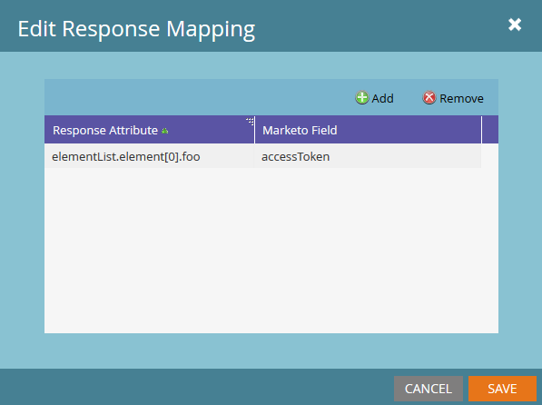

# 响应映射

Marketo可以翻译Webhook从两种内容类型接收的数据，并将这些值返回潜在客户字段：JSON和XML。 Marketo字段参数将始终使用 [SOAP API名称](../rest-api/fields.md) 字段的。 每个Webhook可以有无限数量的响应映射，可通过单击 [!UICONTROL Edit] Webhook的“响应映射”窗格中的按钮：



响应映射是通过“响应属性”、XML或JSON文档中所需属性的路径以及“Marketo字段”的配对创建的，该字段指定了“潜在客户”字段，该字段具有从“响应属性”写入的值。

属性的键必须由字母数字字符、短划线(-)、下划线(_)、冒号(：)和空格组成，以便通过Marketo响应映射进行访问。

## JSON映射

使用点表示法和数组表示法访问JSON属性。 Marketo中的数组表示法不接受字符串作为输入，仅接受整数。 要从JSON文档检索数据，必须将响应类型设置为JSON：

```json
{ "foo":"bar"}
```

要访问 `foo` 在响应映射中，使用 `name` 属性的，因为它在JSON对象的第一级， `foo`. 以下是Marketo中的外观：


下面是数组的一个更复杂的示例：

```json
{
    "profileId" : 1234,
    "firstName" : "Jane",
    "lastName" : "Doe",
    "orders" : [
        {
            "orderId" : 5678,
            "orderDate" : "2015-01-01",
            "orderProductId" : "4982"
        },
        {
            "orderId" : 5678,
            "orderDate" : "2014-05-07",
            "orderProductId" : "4982"
        }
    ]
}
```

我们要从orders数组的第一个元素访问orderDate。 要访问此属性，请使用以下内容： `orders[0].orderDate`

## XML映射

可以从XML文档中的单个元素访问值。 这使用与JSON映射类似的点表示法。 让我们看一下这个简单的示例：

```xml
<?xml version="1.0" encoding="UTF-8"?>
<example>
    <foo>bar</foo>
</example>
```

要在此处访问foo资产，请使用以下内容： `example.foo`

访问之前必须首先引用示例元素 `foo`. 要访问属性，必须在映射中引用层级中的所有元素。 带有数组的XML文档要复杂一些。 使用以下示例：

```xml
<?xml version="1.0" encoding="UTF-8"?>
<elementList>
    <element>
        <foo>baz</foo>
    </element>
    <element>
        <foo>bar</foo>
    </element>
    <element>
        <foo>bar</foo>
    </element>
</elementList>
```

文档由父数组组成 `elementList`，带子项，元素包含一个属性： `foo`. 在Marketo响应映射中，数组被引用为 `elementList.element`，因此可通过访问elementList的子项 `elementList.element[i]`. 为了从elementList的第一个子项中获取foo的值，我们使用此响应属性： `elementList.element[0].foo` 这会将“baz”值返回到我们的指定字段。 尝试访问包含唯一和非唯一元素名称的元素内的属性会导致未定义的行为。 每个元素必须是单个属性或数组，不能混合使用类型。

## 类型

将属性映射到字段时，必须确保webhook响应中的类型与目标字段兼容。 例如，如果响应中的值为字符串，并且所选字段的类型为整数，则不会写入该值。 阅读关于 [字段类型](../rest-api/field-types.md).
